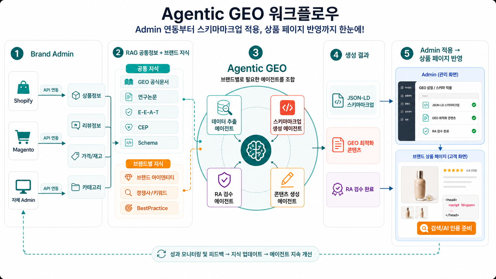
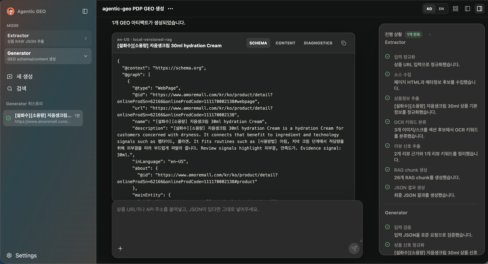
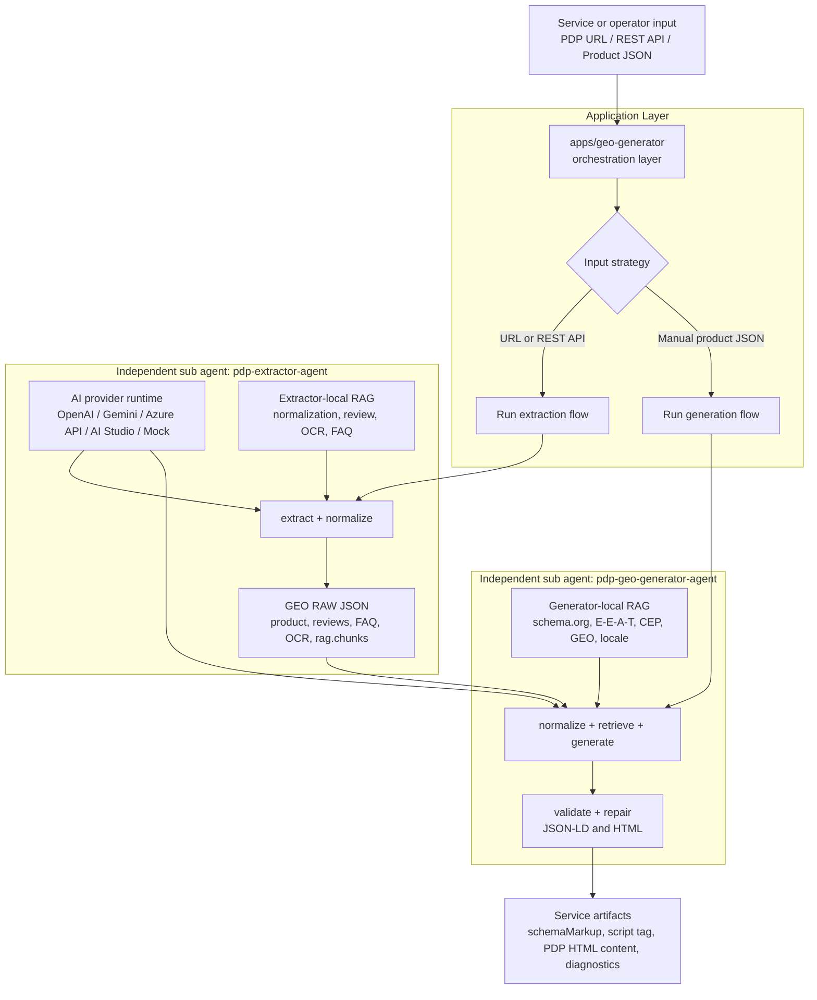

# Agentic GEO



Agentic GEO는 서비스에서 필요한 GEO(Generative Engine Optimization) 작업을 여러 AI agent로 나누고, 입력 유형과 목적에 맞게 오케스트레이션하는 multi AI agent workspace입니다. PDP 상품 페이지, REST API, 임의 상품 JSON을 받아 추출, 정규화, RAG 검색, 생성, 검증 단계를 분리된 agent가 처리하고, 앱은 필요한 조합만 연결해 schema.org JSON-LD와 GEO 최적화 PDP content를 만듭니다.

핵심 방향은 하나의 거대한 처리기가 아니라, 재사용 가능한 agent들을 서비스 요구사항에 따라 조합하는 구조입니다. 각 agent는 자체 RAG와 AI provider를 활용해 상품 정보 해석, 리뷰/OCR/FAQ 신호 분류, agentic query planning, contextual chunking, hybrid retrieval, evidence-bound Content/Schema Planning, schema/content 생성, field-contract validation을 수행합니다. 예를 들어 PDP URL을 입력하면 `pdp-extractor-agent`가 상품/리뷰/OCR/FAQ/RAG 근거를 추출하고, `pdp-geo-generator-agent`가 원자 Evidence Ledger와 strict structured-output plan을 기반으로 JSON-LD와 visible content를 함께 생성합니다.

generator는 RAG를 단순히 많이 넣는 대신 문서/섹션 metadata와 field evidence contract로 관리합니다. 최종 생성 모델에는 선택된 작업 관련 chunk와 evidence ID만 전달하며, FAQ는 개수 quota 없이 근거가 있는 질문만, HowTo는 순차적 다단계 절차일 때만 생성합니다.

## Representative Screen

`apps/geo-generator`의 대표 화면입니다. 좌측에서는 extractor/generator mode와 실행 히스토리를 관리하고, 중앙에서는 생성된 schema/content/diagnostics artifact를 확인하며, 우측에서는 sub agent별 진행 상태와 AI/RAG 기반 진단 로그를 추적합니다.



## Architecture



각 sub agent는 앱 내부 컴포넌트가 아니라 독립 패키지입니다. 함수 API와 REST handler를 제공하므로 단독 실행, 테스트, 다른 서비스 내장도 가능하고, `apps/geo-generator`는 입력과 서비스 목적에 따라 어떤 agent를 어떤 순서로 실행할지만 결정합니다. `apps/pdp-extractor`는 같은 extractor agent를 단독으로 실행해 추출 품질만 검토하는 콘솔입니다.

## End-To-End Flow

| 단계 | 실행 주체 | 입력 | AI 활용 | agent-local RAG | 출력 |
| --- | --- | --- | --- | --- | --- |
| 1. 입력 분기 | `apps/geo-generator` | URL, REST API, Product JSON | provider 설정과 모델 접근 검증 | 없음 | extractor 실행 또는 generator 직접 실행 결정 |
| 2. 상품 추출 | `pdp-extractor-agent` | PDP URL, REST API, HTML | 리뷰 키워드, OCR 후보, FAQ/상품 신호 분류 보조 | `packages/pdp-extractor-agent/src/rag` | GEO RAW JSON, evidence, warning, extractor RAG chunks |
| 3. GEO 생성 | `pdp-geo-generator-agent` | GEO RAW JSON 또는 Product JSON | GEO 문맥 생성, schema/content 구성, locale 표현 보조 | `packages/pdp-geo-generator-agent/src/rag` | schema.org JSON-LD, PDP HTML sections, recommendations |
| 4. 최종 교정/검증 | `pdp-geo-generator-agent` | 생성된 JSON-LD/HTML | evidence-bound 필드에 한정한 선택적 GPT-5.5 fluency-only 교정 후 불변성 gate와 read-only 검증 | generator diagnostics 기준 | final artifacts, finalized provenance, proofreading decisions, validation findings |
| 5. 앱 표시/복사 | `apps/geo-generator` | agent 결과와 logs | AI 실행 결과와 진단 로그 시각화 | 없음 | 복사 가능한 script tag, content HTML, diagnostics panel |

## Sub Agent Composition

Agentic GEO의 기본 구성은 다음과 같습니다.

| Sub agent | 담당 | AI 활용 | 자체 RAG | 독립 실행 | 오케스트레이션 활용 |
| --- | --- | --- | --- | --- | --- |
| `pdp-extractor-agent` | URL/REST/HTML에서 상품 기본 정보, 리뷰, OCR 후보, FAQ 후보, RAG chunk, evidence/warning 추출 | 상품/리뷰/OCR/FAQ 신호 분류와 요약 품질 보강 | extractor RAG profile | 가능 | PDP 기반 서비스에서 raw product intelligence 생성 |
| `pdp-geo-generator-agent` | 임의 상품 JSON을 product signal로 정규화하고 RAG 검색, locale terminology, schema/content 생성, final proofreading과 read-only validation 수행 | GEO 친화적 문장 구성, schema/content 생성, locale 표현 판단 | generator RAG profile | 가능 | 추출 결과 또는 내부 상품 API 데이터를 GEO artifact로 변환 |
| validation/diagnostics flow | JSON-LD graph, Product 필수 필드, FAQ/HowTo 구조, 안전한 accordion HTML 검증 및 보정 | 생성 결과의 누락/불일치 진단 보조 | generator diagnostics | generator 내부 포함 | 앱 우측 패널과 REST 응답에서 warnings/evidence로 노출 |

이 구조 덕분에 서비스별 요구사항에 따라 다음처럼 다르게 조합할 수 있습니다.

| 서비스 상황 | 권장 흐름 |
| --- | --- |
| PDP URL만 있는 운영 도구 | extractor -> generator -> validation |
| 상품 API JSON이 이미 있는 커머스 백오피스 | generator -> validation |
| 추출 품질만 검토하는 내부 QA | extractor만 실행하고 GEO RAW JSON/evidence 확인 |
| 자체 vector DB나 reranker를 쓰는 서비스 | generator의 `managed-vector-store-rag` 또는 `customRetriever`로 교체 |

## Workspace

| 위치 | 역할 |
| --- | --- |
| `apps/geo-generator` | PDP 추출, GEO 생성, validation diagnostics를 연결하는 메인 Next.js 콘솔 |
| `apps/pdp-extractor` | 상품 추출 sub agent를 단독으로 실행하고 GEO RAW JSON을 검토하는 Next.js 콘솔 |
| `packages/pdp-extractor-agent` | 상품 URL/REST API/HTML에서 product intelligence와 RAG 근거를 추출하는 재사용 패키지 |
| `packages/pdp-geo-generator-agent` | 임의 상품 JSON에서 schema.org JSON-LD, PDP HTML content, diagnostics를 생성하는 재사용 패키지 |

## GEO Artifacts

`packages/pdp-geo-generator-agent`는 서비스가 바로 사용할 수 있는 두 가지 핵심 산출물을 생성합니다.

- `schemaMarkup`: 필수 `Product`/`WebPage`와 근거가 있을 때만 선택되는 `FAQPage`/`HowTo`/`BreadcrumbList`를 포함한 schema.org JSON-LD
- `content`: `productName`, `description`, `quickFacts`, `benefits`, `ingredients`, `howToUse`, `faq` 섹션을 포함하는 GEO 최적화 accordion HTML

진단 정보는 `evidenceLedger`, `contentPlan`, `recommendations`, `evidence`, `terminology`, `validationWarnings`, `selectedRagChunks`, `ragMode`로 분리되어 앱 우측 패널이나 REST 응답에서 확인할 수 있습니다.

## RAG And Validation

Agentic GEO는 agent별로 RAG profile을 분리합니다. extractor는 추출과 원천 데이터 정규화에 필요한 RAG를 갖고, generator는 schema/content 생성과 locale terminology에 필요한 RAG를 갖습니다. 앱은 두 profile을 함께 읽고 저장할 수 있지만, 각 agent는 자기 RAG 문서와 manifest를 기준으로 독립적으로 실행됩니다.

RAG 관리는 대표 문서 하나를 수동으로 따라가는 방식이 아니라 typed RAG index를 중심으로 동작합니다. 각 RAG 문서는 문서명, source role, intent, field target, priority를 갖고, heading 단위 chunk는 `FAQPage.mainEntity`, `HowTo.step`, `Product.description`, `WebPage.description`, `Product.additionalProperty` 같은 적용 필드와 연결됩니다. 따라서 상품정보가 일부만 바뀌어 FAQ나 HowToUse만 업데이트해야 할 때도 agentic query planning이 해당 필드 중심 subquery를 만들고, 필요한 RAG chunk만 우선 검색합니다.

generator는 전체 RAG 정책을 compiled policy checklist로 컴파일해 `diagnostics.policyCoverage`로 커버리지를 계측합니다. 기본 Content Plan 요청에는 선택 chunk와 원자 evidence, 그리고 컴파일된 규칙의 압축 표현을 전달합니다. hydration된 전체 전략 문서는 넣지 않으며, 명시적인 legacy copy refinement를 사용할 때만 동일 checklist를 후속 검증 프롬프트에도 전달합니다.

| Agent | RAG 위치 | 목적 |
| --- | --- | --- |
| `pdp-extractor-agent` | `packages/pdp-extractor-agent/src/rag` | 상품 정규화, 리뷰 키워드 추출, OCR 후보 분류, FAQ 추출 기준 |
| `pdp-geo-generator-agent` | `packages/pdp-geo-generator-agent/src/rag` | schema.org graph 구성, E-E-A-T, CEP, BestPractice, GEO guidance, official docs, locale 표현/용어 기준 |

Extractor RAG 파일:

```txt
packages/pdp-extractor-agent/src/rag/
  analysis-prompt_v1.md
  product-normalization_v1.md
  review-keyword-extraction_v1.md
  ocr-keyword-classification_v1.md
  faq-extraction_v1.md
```

Generator의 기본 RAG 모드는 `local-versioned-rag`입니다. 패키지 안의 버전 관리 RAG 파일을 chunking, deterministic hash embedding, local hybrid reranking으로 검색하므로 OpenAI가 아닌 provider도 사용할 수 있습니다.

선택적으로 `managed-vector-store-rag`를 사용할 수 있습니다. 첫 adapter는 OpenAI Vector Store Search를 지원하고, `customRetriever` 계약을 통해 다른 vector DB나 reranker로 교체할 수 있게 설계되어 있습니다.

Generator RAG 파일:

```txt
packages/pdp-geo-generator-agent/src/rag/
  analysis-prompt_v1.md
  schema-org-product_v1.md
  eeat_v1.md
  cep_v1.md
  best-practice_v1.md
  geo-research_v1.md
  official-ai-search-platform-docs_v1.md
  locale-expression-guidelines_v1.md
  locale-terminology-map_v1.json
```

RAG 문서명은 역할 중심으로 관리합니다. `eeat_v1.md`는 신뢰/근거 품질, `cep_v1.md`는 customer entry point와 구매 의도, `geo-research_v1.md`는 generative search/GEO 리서치 기반 원칙을 담습니다. 이 세 문서는 FAQ, HowTo, claims, customer context, review-intent FAQ 전 영역에 공통 근거로 사용하고, `schema`, `best-practice`, `official-docs`, `locale` 문서는 영역별 보강 근거로 조합합니다.

추가 RAG 문서는 파일 단위가 아니라 chunk 단위로 GEO intent를 분석합니다. heading, 본문, 표/문단 단서를 기준으로 `faq`, `howTo`, `claims`, `customer`, `review`, `schema`, `locale`, `evidence`, `retrieval`, `general` intent와 `FAQPage.mainEntity`, `HowTo.step`, `Product.description`, `WebPage.description`, `Product.additionalProperty` 같은 field target을 chunk metadata에 남깁니다. 생성 reasoning 단계에서는 각 요소에 맞는 intent/field target chunk를 우선 사용하므로, 예를 들어 한 문서 안의 FAQ 지침은 FAQ 생성에, HowTo 지침은 사용법 생성에, evidence 지침은 claim/additionalProperty 구성에 연결됩니다.

RAG 문서 안에 연구 논문, GEO 트렌드 리포트, 공식 가이드 URL이 들어 있는 경우 `rag.resolveUrls: true`를 켜면 URL 내용을 가져와 별도 RAG 문서처럼 chunking합니다. 가져온 HTML/텍스트도 동일하게 intent와 field target을 분석하므로 URL 문서의 FAQ 지침, HowTo 지침, evidence/claim 지침이 생성 요소에 맞게 라우팅됩니다. 기본 resolver는 `http/https`만 허용하고 localhost/private IP는 차단하며, `allowedUrlDomains`, `maxResolvedUrlDocuments`, `urlFetchTimeoutMs`로 범위를 제한할 수 있습니다.

URL 문서는 원문 전체를 넣지 않고 공식 논문/공식문서에서 GEO 생성에 필요한 부분만 발췌합니다. `official-paper`, `schema-reference`, `provider-doc`, `official-doc` 유형으로 분류한 뒤 citation readiness, source evidence, structured data eligibility, schema type/property compatibility, retrieval/grounding mechanics처럼 FAQ/HowTo/claims/customer/review reasoning에 도움이 되는 문단만 남깁니다. SDK 설치법, 인증, 가격, 사이트 내비게이션, 코드블록 예시 URL은 기본적으로 제외합니다.

Validation flow는 생성된 JSON-LD와 HTML을 그대로 반환하지 않고 다음 항목을 확인합니다.

- `@context`, `@graph`, `Product.name`, `Product.description` 같은 기본 graph 구조
- `FAQPage`의 Question/Answer, `HowTo`의 step 구조
- `HowTo.step`에는 사용 행동만, `ingredients`에는 성분/공식/INCI 근거만, `benefits`에는 효능/효과 요약만 들어가는 field evidence contract
- `<script>`, inline event, style attribute 같은 안전하지 않은 accordion HTML 요소
- 문법이 깨진 문장, 내부 diagnostic label, 원시 URL/이미지 경로, 반복/오염 표현
- 문제가 발견되면 공개 산출물을 다시 쓰지 않고 `validationWarnings`, `validationFindings`, `evidence`에 진단과 제안 조치 기록 (`validationRepairs`는 legacy 직접 repair API 호환용)

## Getting Started

```bash
pnpm install
pnpm dev
```

기본 앱은 `apps/geo-generator`입니다.

```txt
http://localhost:3000
```

PDP extractor 앱만 실행하려면 다음 명령을 사용합니다.

```bash
pnpm dev:pdp-extractor
```

## Main Commands

| 명령어 | 설명 |
| --- | --- |
| `pnpm dev` | GEO Generator 개발 서버 실행 |
| `pnpm dev:geo-generator` | GEO Generator 개발 서버 실행 |
| `pnpm dev:pdp-extractor` | PDP Extractor 개발 서버 실행 |
| `pnpm typecheck` | 전체 TypeScript 검사 |
| `pnpm test` | 패키지 테스트 실행 |
| `pnpm build` | 전체 빌드 |
| `pnpm build:pages` | GEO Generator GitHub Pages 산출물 생성 |
| `pnpm build:pages:pdp` | PDP Extractor GitHub Pages 산출물 생성 |

## AI Provider

AI provider는 sub agent가 상품 데이터를 의미 기반으로 해석하도록 돕는 실행 계층입니다. generator는 OpenAI, Gemini, Azure API, AI Studio의 provider-native structured output으로 evidence ID가 연결된 description/FAQ/CEP/HowTo 계획을 만들며, 근거·locale gate 실패 필드만 재추론한 뒤 계속 실패하면 생략합니다.

지원 provider:

- `mock`
- `openai`
- `gemini`
- `azure-openai` (UI에서는 `Azure API`로 표시)
- `aistudio` (UI에서는 `AI Studio`로 표시)

환경 변수 예시:

기존 설정과 배포 호환성을 위해 환경 변수명은 `AZURE_OPENAI_*`를 유지하지만, 앱 UI에서는 이 연동을 `Azure API`로 표시합니다.

```env
AGENTIC_GEO_PROVIDER=openai
OPENAI_API_KEY=
OPENAI_MODEL=

AGENTIC_GEO_PROVIDER=gemini
GEMINI_API_KEY=
GEMINI_MODEL=

AGENTIC_GEO_PROVIDER=azure-openai
AZURE_OPENAI_API_KEY=
AZURE_OPENAI_ENDPOINT=
AZURE_OPENAI_DEPLOYMENT=
AZURE_OPENAI_OCR_DEPLOYMENT=gpt-5.5
AZURE_OPENAI_REASONING_DEPLOYMENT=gpt-5.5
AZURE_OPENAI_PROOFREADING_DEPLOYMENT=gpt-5.5
AZURE_OPENAI_EMBEDDING_DEPLOYMENT=text-embedding-3-large
AZURE_OPENAI_API_VERSION=2025-04-01-preview
# 선택: chat/OCR 모델 호출의 sampling temperature. 비워 두면 요청 body에서 생략되어
# 기본값(1)만 허용하는 모델(예: gpt-5.5)이 HTTP 400으로 거부되지 않습니다.
AZURE_OPENAI_TEMPERATURE=

AGENTIC_GEO_RERANKER_PROVIDER=azure-ai-search-semantic
AZURE_AI_SEARCH_API_KEY=
AZURE_AI_SEARCH_ENDPOINT=
AZURE_AI_SEARCH_INDEX_NAME=
AZURE_AI_SEARCH_SEMANTIC_CONFIGURATION=default
AZURE_AI_SEARCH_QUERY_LANGUAGE=ko-kr
```

### AI Studio 외부에이전트

`aistudio` provider는 AI Studio 외부에이전트 게이트웨이 하나로 세 역할(OCR/추론, embedding, rerank)을 모두 호출합니다. 게이트웨이는 Azure OpenAI(chat/embedding)와 AWS Bedrock(cohere rerank)을 프록시하며, 인증은 세 호출 모두 `Authorization: Bearer {api_key}`를 공통으로 사용합니다.

이 provider는 환경 변수가 아니라 두 앱의 AI 설정 화면에서 **Endpoint URL + API Key**를 입력해 세션 단위로 구성합니다. 모델 ID는 다음 기본값으로 채워지며 수정할 수 있습니다.

- OCR/추론: `gpt-5.5` → `{endpoint}/openai/deployments/{model}/chat/completions`
- Embedding: `text-embedding-3-large` → `{endpoint}/openai/deployments/{model}/embeddings`
- Rerank(선택): `cohere.rerank-v3-5:0` → `{endpoint}/model/{model}/invoke` (Bedrock)

`API Version`은 선택값으로, 입력하면 Azure 호환 경로에 `?api-version=`으로 붙고 비워두면 생략됩니다. 연결 테스트는 embedding(없으면 reasoning) 모델로 가벼운 도달성 호출을 수행하며, 401/403/404/5xx 상태 코드를 입력 확인 안내로 변환해 보여줍니다.

`temperature`는 설정값이 있을 때만 chat/OCR 요청 body에 포함되고, 미지정 시 생략됩니다. `gpt-5.5`처럼 기본값(1)만 허용하는 모델은 `temperature: 0`/`0.1`을 보내면 `400 Unsupported value: 'temperature'`로 거부되므로, 기본 동작(생략)을 유지하면 OCR/추론/카피 정제 호출이 정상 동작합니다. 값이 필요하면 `AZURE_OPENAI_TEMPERATURE`(또는 REST `llm.temperature`)로 지정합니다.

### Azure API + Azure AI Search 권장 파이프라인

긴 PDP 상세페이지 이미지, 성분표, 표, 문단 구조를 안정적으로 추출하고 GEO RAW JSON과 schema/content 생성까지 이어가려면 Azure에서 배포한 GPT/embedding 모델과 Azure AI Search 검색 계층을 역할별로 분리하는 구성이 좋습니다. 이 구성에서 모든 단계가 모델은 아닙니다. 모델이 필요한 단계와 검색 알고리즘/서비스로 처리되는 단계를 분리하면 비용, 품질, 운영 범위를 더 명확하게 조정할 수 있습니다.

| 단계 | 권장 구성 | 모델 여부 | 역할 |
| --- | --- | --- | --- |
| Chunking | section-aware deterministic chunking | 모델 없음 | 상세페이지 HTML/OCR 텍스트를 제목, 문단, 표 row, 성분표, FAQ, 사용법 같은 구조 단위로 재현 가능하게 나눕니다. |
| Embedding | `text-embedding-3-large` | embedding 모델 | chunk와 query를 벡터로 변환해 의미 기반 검색이 가능하게 합니다. 품질 우선 구성에서는 `3-large`가 적합하고, 비용 우선이면 `3-small`로 낮출 수 있습니다. |
| Retrieval | Azure AI Search hybrid search | 검색 서비스/알고리즘 | BM25 키워드 검색과 vector search를 함께 사용해 정확한 성분명/수치/고유명사와 의미적으로 가까운 문맥을 동시에 찾습니다. |
| Reranking | Azure AI Search semantic ranker | 랭킹 기능 | hybrid search가 가져온 후보를 query와 문맥 관련성 기준으로 다시 정렬합니다. 앱에서는 Cohere Rerank도 선택할 수 있지만, Azure 중심 구성에서는 semantic ranker를 기본 후보로 둘 수 있습니다. |
| OCR/structure extraction | `gpt-5.5` | vision/reasoning 모델 | 긴 상세페이지 이미지에서 보이는 텍스트, 표, 성분표, 문단 순서, footnote, 수치 정보를 JSON-friendly 구조로 추출합니다. |
| Evidence-bound Content/Schema Planning | `gpt-5.5` | reasoning 모델 | 원자 product evidence ID와 선택 RAG chunk를 근거로 description, FAQ, CEP, HowTo의 포함 여부와 문장을 strict JSON으로 계획합니다. |

실행 흐름은 다음처럼 이해하면 됩니다.

```txt
PDP URL/REST API/HTML
  -> OCR/structure extraction: gpt-5.5
  -> section-aware deterministic chunking
  -> Embedding: text-embedding-3-large
  -> Retrieval: Azure AI Search hybrid search
  -> Reranking: Azure AI Search semantic ranker
  -> Evidence Ledger + Content/Schema Plan: gpt-5.5
  -> deterministic graph/HTML rendering + evidence/locale/graph validation
  -> GEO RAW JSON / schemaMarkup / PDP content / diagnostics
```

`Chunking`, `Retrieval`, `Reranking`, graph/HTML rendering은 LLM 생성 모델을 직접 호출하지 않습니다. `Embedding`, `OCR/structure extraction`, `Content/Schema Planning`은 명시적인 모델 deployment가 필요합니다. Azure 설정 화면에서는 이 역할별 deployment와 search/reranking 설정을 분리해 입력할 수 있습니다.

## More Docs

- [apps/geo-generator/README.md](apps/geo-generator/README.md)
- [apps/pdp-extractor/README.md](apps/pdp-extractor/README.md)
- [packages/pdp-extractor-agent/README.md](packages/pdp-extractor-agent/README.md)
- [packages/pdp-geo-generator-agent/README.md](packages/pdp-geo-generator-agent/README.md)

## License

MIT License. You may use, copy, modify, and distribute this project as long as the copyright notice and license notice are included.

Copyright (c) 2026 jungtaeinn
