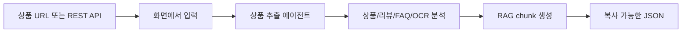

# Agentic GEO

Agentic GEO는 상품 상세 페이지 URL 또는 상품 REST API 주소를 넣으면 상품명, 가격, 설명, 옵션, FAQ, 리뷰 신호, OCR 후보 키워드, RAG chunk를 하나의 JSON 결과로 정리하는 프로젝트입니다.

비개발자 관점에서는 "상품 페이지를 넣으면 AI 검색 최적화와 콘텐츠 생성에 필요한 원천 데이터를 정리해 주는 도구"라고 이해하면 됩니다.

## 한눈에 보기



## 무엇을 할 수 있나요?

- 상품 상세 페이지 URL을 입력해 상품 정보를 추출합니다.
- REST API 주소를 입력해 JSON 응답에서 상품 정보를 정리합니다.
- 여러 URL을 한 번에 입력하고 처리 결과를 히스토리로 확인합니다.
- OpenAI, Gemini, Azure OpenAI 중 하나를 연결해 실제 AI 분석을 실행합니다.
- RAG 프로필과 분석 프롬프트를 화면에서 관리합니다.
- 최종 결과를 GEO RAW JSON 형태로 복사합니다.
- 추출된 JSON에 대해 간단한 수정 요청을 입력해 결과를 다듬습니다.

## 프로젝트 구성

```txt
agentic-geo/
  apps/
    product-extractor/
      README.md
      src/app/
        page.tsx                  # Product Extractor 화면
        components/
          ExtractorConsole.tsx     # 채팅형 추출 콘솔 UI
        api/
          extract/route.ts         # 추출 API
          provider/validate/route.ts
          rag-profile/route.ts

  packages/
    product-extractor-agent/
      README.md
      src/
        agent.ts                   # 상품 추출 파이프라인
        rest.ts                    # REST 어댑터
        refine.ts                  # GEO RAW JSON 수정 로직
        types.ts                   # 공개 타입 계약
        llm/                       # OpenAI/Gemini/Azure/Mock provider
        rag/                       # 분석 프롬프트와 RAG 기준 문서
```

역할을 간단히 나누면 다음과 같습니다.

| 위치 | 역할 |
| --- | --- |
| `apps/product-extractor` | 사용자가 보는 웹 화면과 Next.js API |
| `packages/product-extractor-agent` | 실제 상품 정보 추출, 분석, JSON 생성 로직 |
| `packages/product-extractor-agent/src/rag` | 분석 기준이 되는 프롬프트와 RAG 문서 |

## 처음 실행하기

### 1. 준비물

- Node.js가 설치되어 있어야 합니다.
- pnpm을 사용합니다. 이 저장소는 `pnpm@10.30.0` 기준입니다.

Corepack을 쓰는 환경이라면 다음처럼 pnpm을 준비할 수 있습니다.

```bash
corepack enable
corepack pnpm --version
```

### 2. 의존성 설치

```bash
pnpm install
```

### 3. 개발 서버 실행

```bash
pnpm dev
```

브라우저에서 다음 주소를 엽니다.

```txt
http://localhost:3000
```

## 기본 사용법

1. 화면 하단 입력창에 상품 URL 또는 REST API 주소를 입력합니다.
2. 처음 사용하는 경우 좌측 하단의 `설정`에서 AI provider를 연결합니다.
3. OpenAI, Gemini, Azure OpenAI 중 하나를 선택하고 API Key와 모델을 확인합니다.
4. 연결 테스트를 통과하면 입력창에서 Enter 또는 전송 버튼으로 추출을 실행합니다.
5. 우측 패널에서 진행 상황, 출력 요약, 출처를 확인합니다.
6. 결과 카드 또는 우측 패널에서 JSON을 복사합니다.

여러 상품을 한 번에 처리하려면 한 줄에 하나씩 입력합니다.

```txt
https://example.com/products/a
https://example.com/products/b
https://example.com/products/c
```

## AI 연결 방식

로컬 개발 화면에서는 설정 모달에서 API Key를 입력하고 연결 테스트를 할 수 있습니다.

지원 provider:

- OpenAI
- Gemini
- Azure OpenAI

서버 환경 변수로 기본 provider를 지정할 수도 있습니다.

```env
AGENTIC_GEO_PROVIDER=openai
OPENAI_API_KEY=
OPENAI_MODEL=

AGENTIC_GEO_PROVIDER=gemini
GEMINI_API_KEY=
GEMINI_MODEL=

AGENTIC_GEO_PROVIDER=azure-openai
AZURE_OPENAI_API_KEY=
AZURE_OPENAI_ENDPOINT=
AZURE_OPENAI_DEPLOYMENT=
AZURE_OPENAI_API_VERSION=
```

주의: 공개 정적 배포 페이지에 개인 API Key를 직접 입력하는 방식은 권장하지 않습니다. 공개 배포에서는 별도 서버에 추출 API를 두고 `NEXT_PUBLIC_AGENTIC_GEO_API_URL`로 연결하는 구성이 안전합니다.

## RAG 프로필 관리

Product Extractor는 패키지 안의 RAG 문서를 분석 기준으로 사용합니다.

```txt
packages/product-extractor-agent/src/rag/
  analysis-prompt_v1.md
  product-normalization_v1.md
  review-keyword-extraction_v1.md
  ocr-keyword-classification_v1.md
  faq-extraction_v1.md
```

화면의 설정에서 분석 프롬프트와 RAG 파일을 편집하면 로컬 개발 환경에서는 이 패키지 파일과 동기화됩니다.

파일 버전은 파일명으로 관리합니다.

```txt
{purpose}_v1.md
{purpose}_v2.md
```

## 주요 명령어

| 명령어 | 설명 |
| --- | --- |
| `pnpm dev` | Product Extractor 개발 서버 실행 |
| `pnpm lint` | 전체 워크스페이스 lint |
| `pnpm typecheck` | 전체 TypeScript 검사 |
| `pnpm test` | 패키지 테스트 실행 |
| `pnpm build` | 전체 빌드 |
| `pnpm build:pages` | GitHub Pages용 정적 산출물 생성 |

앱만 실행하거나 검사하려면 다음처럼 필터를 사용할 수 있습니다.

```bash
pnpm --filter @agentic-geo/product-extractor dev
pnpm --filter @agentic-geo/product-extractor lint
pnpm --filter @agentic-geo/product-extractor typecheck
```

에이전트 패키지만 테스트하려면 다음을 사용합니다.

```bash
pnpm --filter @agentic-geo/product-extractor-agent test
```

## API 호출 예시

개발 서버가 켜져 있을 때 추출 API를 직접 호출할 수 있습니다.

```bash
curl -X POST http://localhost:3000/api/extract \
  -H "Content-Type: application/json" \
  -d '{"sources":["https://example.com/products/a"],"sourceType":"url"}'
```

REST API 소스를 호출할 때는 `sourceType`을 `restApi`로 보냅니다.

```bash
curl -X POST http://localhost:3000/api/extract \
  -H "Content-Type: application/json" \
  -d '{"sources":["https://example.com/api/products/a"],"sourceType":"restApi"}'
```

## 더 자세히 보기

- 앱 사용과 화면 구조: [apps/product-extractor/README.md](apps/product-extractor/README.md)
- 에이전트 패키지 API와 내부 구조: [packages/product-extractor-agent/README.md](packages/product-extractor-agent/README.md)
