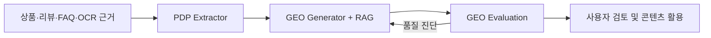
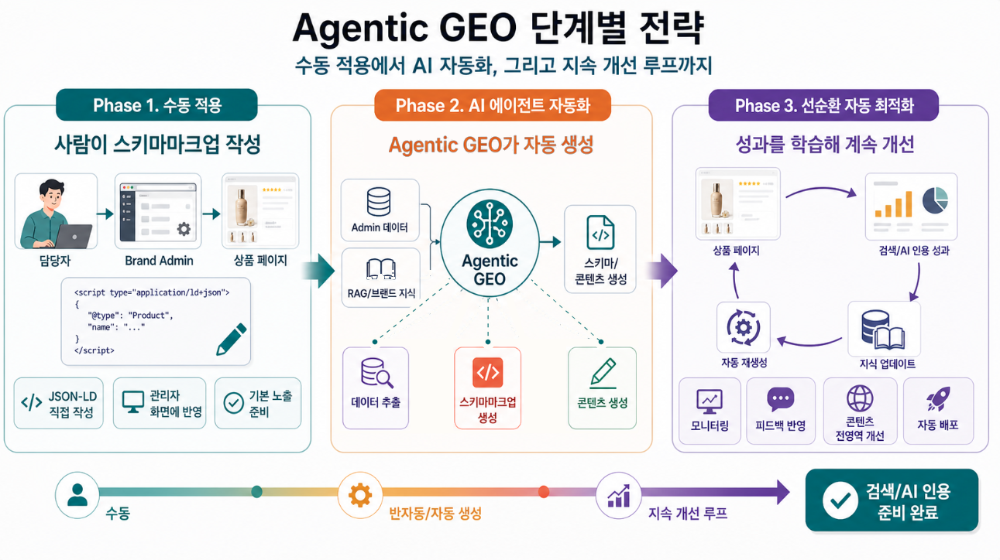
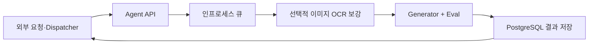

# Agentic GEO

Agentic GEO는 상품 상세 페이지(PDP)를 근거 중심으로 해석하고, GEO(Generative Engine Optimization)·CEP(Customer Entry Point)·E-E-A-T 원칙을 반영한 schema.org JSON-LD와 answer-ready 콘텐츠를 생성·평가하는 개인 AI 에이전트 프로젝트입니다.

이 저장소는 TypeScript·pnpm·Turborepo 기반 모노레포입니다. URL/REST API/HTML에서 상품·리뷰·FAQ·OCR 신호를 추출하는 agent, 임의 상품 JSON을 RAG 근거와 함께 schema/content로 변환하는 agent, 완성된 산출물을 독립적으로 평가하는 agent를 앱이 목적에 맞게 조합합니다.

핵심 원칙은 다음과 같습니다.

- 상품 사실과 생성 문장을 evidence ID로 연결하고, 근거가 없는 FAQ·HowTo·claim은 만들지 않습니다.
- RAG는 문서 전체를 무작정 주입하지 않고 intent·field target별 query planning, contextual chunking, hybrid retrieval, reranking을 거칩니다.
- 생성 결과는 graph integrity, field evidence contract, 공개 HTML 안전성, GEO·CEP·E-E-A-T 품질 기준으로 검증합니다.
- UI, 비동기 API, agent package를 분리해 대화형 도구·백오피스·batch/dispatcher 연동에서 같은 핵심 로직을 재사용합니다.

## Product Feedback Loop


```mermaid
flowchart LR
  intent["상품·리뷰·FAQ·OCR 근거"] --> extraction["PDP Extractor"]
  extraction --> generation["GEO Generator + RAG"]
  generation --> evaluation["GEO Evaluation"]
  evaluation --> review["사용자 검토 및 콘텐츠 활용"]
  evaluation -->|"품질 진단"| generation
```

이 흐름은 프로젝트의 추출·생성·평가 경계를 보여줍니다. 외부 검색 서비스의 실제 인용률이나 매출 개선을 보장하지 않습니다.

| 단계 | 최신 코드에서의 구현 | 주요 결과 |
| --- | --- | --- |
| 1. Customer Intent Intelligence | `pdp-extractor-agent`가 상품 본문, 구조화 데이터, 리뷰, FAQ, 이미지/OCR 후보를 상품 신호와 evidence로 정규화합니다. | GEO RAW JSON, RAG chunks, evidence, warnings |
| 2. Agentic GEO | `pdp-geo-generator-agent`가 상품 근거와 버전 관리 RAG를 결합해 Content/Schema Plan을 세우고 schema.org JSON-LD와 PDP 콘텐츠를 생성합니다. | `schemaMarkup`, `content`, generation diagnostics |
| 3. GEO Evaluation | `pdp-geo-eval-agent`가 결정적 GEO·CEP·E-E-A-T 루브릭과 선택적 citation probe로 결과를 평가합니다. Generator의 quality gate도 같은 평가 계약을 사용합니다. | dimension scores, improvements, citation diagnostics |
| Feedback | 품질 미달 시 Generator가 지적된 항목만 한 번 보정하고, 점수·경고가 실제로 개선될 때만 결과를 채택합니다. | adopted/rolled-back correction, quality-gate diagnostics |

현재 코드는 추출·생성·결정적 평가·모의 citation probe까지 제공합니다. 실제 외부 검색/AI 서비스의 장기 노출 수집, 운영 대시보드, 자동 지식 업데이트는 이 저장소 밖의 데이터·배포 연동 영역입니다.

## Adoption Roadmap



| 단계 | 이 저장소에서의 상태 |
| --- | --- |
| Phase 1. 수동 적용 | 구현됨. Generator에 상품 JSON을 직접 넣고 복사 가능한 JSON-LD script와 HTML 콘텐츠를 검토할 수 있습니다. |
| Phase 2. AI agent 자동화 | 구현됨. Extractor → Generator 조합, provider-backed normalization/planning/proofreading, RAG 검색, REST adapter, 대화형 콘솔과 비동기 API를 제공합니다. |
| Phase 3. 선순환 최적화 | 일부 구현됨. 독립 Eval Agent, deterministic rubric, benchmark, 선택적 citation probe, one-pass quality correction이 있습니다. 실제 검색 노출 모니터링·지식 자동 갱신·자동 배포는 외부 운영 계층이 담당해야 합니다. |

## Operational Architecture


```mermaid
flowchart LR
  upstream["외부 요청·Dispatcher"] --> api["Agent API"]
  api --> queue["인프로세스 큐"]
  queue --> ocr["선택적 이미지 OCR 보강"]
  ocr --> generator["Generator + Eval"]
  generator --> database["PostgreSQL 결과 저장"]
  database --> upstream
```

앱, 에이전트, 저장소와 외부 연동 경계를 분리합니다. 실제 경로와 구현 범위는 아래와 같습니다.

| 다이어그램 역할 | 저장소 대응 | 현재 책임과 경계 |
| --- | --- | --- |
| Brand Admin / Request Input | 외부 연동 경계 | 상품·리뷰·locale·callback 정보를 만드는 upstream UI/API는 포함하지 않습니다. |
| `external/upstream-api` | `apps/agent-api` | `x-api-key` 보호, DTO 검증, `geoGenerationId` 상태 확인, 인프로세스 큐 접수와 즉시 HTTP 202 응답을 담당합니다. |
| PostgreSQL Workflow Store | `apps/agent-api/src/geo/persistence` | 기존 `geo_generation` 상태를 읽고 `geo_result`를 기록합니다. TypeORM은 `synchronize:false`, `migrationsRun:false`이며 스키마 소유권은 upstream에 있습니다. |
| `agentic-geo/core` extraction | `packages/pdp-extractor-agent` | URL/REST/HTML을 GEO RAW JSON으로 바꿉니다. 대화형 앱은 전체 추출을 수행하고, `agent-api`는 입력 상품에 OCR 이미지가 있으면 이 agent로 이미지 근거를 보강합니다. |
| `agentic-geo/core` generation | `packages/pdp-geo-generator-agent` | 정규화, RAG, schema/content 생성, 검증과 quality gate를 실행합니다. `apps/agent-api`가 직접 재사용합니다. |
| 평가 계층 | `packages/pdp-geo-eval-agent` | Generator와 구조적 타입 계약으로 연결되며, 독립 품질 평가·benchmark·citation probe도 제공합니다. |
| `external/dispatcher`, callback, 알림 | 외부 연동 경계 | poll/lease, stale job 회수, callback 전달, Teams 같은 운영 알림은 다이어그램의 target architecture이며 이 저장소에는 구현되어 있지 않습니다. |

`apps/agent-api`의 큐는 단일 프로세스 메모리에 있으므로 재시작 시 대기/실행 작업을 보존하지 않습니다. 실패한 작업은 제한된 exponential backoff 후 `FAILED`로 전이하며, 프로세스 중단으로 `PROCESSING`에 남은 작업을 회수하는 stale sweep은 외부 dispatcher의 책임입니다.

## Repository Structure

| 위치 | 역할 | 직접 사용하는 agent |
| --- | --- | --- |
| `apps/geo-generator` | 추출·생성·평가 결과를 한 화면에서 실행하고 비교하는 Next.js 16 콘솔 | Extractor, Generator, Eval |
| `apps/pdp-extractor` | 추출 단계와 GEO RAW JSON/evidence만 독립 검토하는 Next.js 16 콘솔 | Extractor |
| `apps/agent-api` | PostgreSQL 상태와 연동해 생성 요청을 비동기로 처리하는 NestJS 11 서비스 | 선택적 Extractor OCR, Generator, Eval |
| `packages/pdp-extractor-agent` | URL, REST API, HTML, 리뷰, FAQ, OCR 후보를 정규화하는 재사용 agent | 독립 패키지 |
| `packages/pdp-geo-generator-agent` | 임의 상품 JSON에서 RAG-grounded schema/content/diagnostics를 만드는 재사용 agent | Eval에 의존 |
| `packages/pdp-geo-eval-agent` | 임의의 PDP JSON-LD와 diagnostics를 평가하는 무의존 agent | 다른 workspace package에 의존하지 않음 |

의존성은 상위 응용 계층에서 재사용 agent 쪽으로 흐릅니다. `pdp-geo-generator-agent`만 공통 품질 게이트를 위해 Eval Agent에 의존하고, Eval Agent는 Extractor/Generator 타입을 import하지 않은 채 구조적 입력 계약을 사용합니다. 따라서 수작업 JSON-LD나 다른 CMS가 만든 산출물도 같은 기준으로 평가할 수 있습니다.

## End-to-End Flows

### Interactive Orchestration

| 단계 | 실행 주체 | 처리 |
| --- | --- | --- |
| 1. 입력 분기 | `apps/geo-generator` | PDP URL, REST API 또는 manual Product JSON을 구분합니다. |
| 2. 선택적 추출 | `pdp-extractor-agent` | URL/REST/HTML 입력일 때 fetch → extract → OCR 후보 → review/FAQ → RAG chunk → GEO RAW JSON 순서로 실행합니다. |
| 3. 생성 | `pdp-geo-generator-agent` | ProductSignal 정규화, RAG query planning/retrieval, Evidence Ledger, Content/Schema Plan, JSON-LD/HTML 렌더링을 수행합니다. |
| 4. 검증과 품질 게이트 | Generator + Eval | deterministic validation 후 GEO·CEP·E-E-A-T 기준을 평가하고, 필요한 경우 표적 보정 1회를 실행해 개선된 결과만 채택합니다. |
| 5. 평가 표시 | `apps/geo-generator` | 품질 점수와 개선 항목을 표시하고, 요청 시 simulated-engine citation probe 결과를 함께 보여줍니다. |
| 6. 활용 | 사용자/호출 앱 | JSON-LD script, PDP HTML content, diagnostics와 evidence를 복사하거나 API 응답으로 사용합니다. |

### Asynchronous API Path

| 단계 | 실행 주체 | 처리 |
| --- | --- | --- |
| 1. 작업 준비 | 외부 upstream/dispatcher | PostgreSQL에 `PROCESSING` 작업을 준비하고 product payload와 `geoGenerationId`를 전달합니다. |
| 2. 접수 | `apps/agent-api` | API key와 body를 검증하고 DB 상태·큐 용량·중복 ID를 확인한 뒤 202를 반환합니다. |
| 3. 실행 | `GeoQueue` + `GeoProcessor` | concurrency 제한이 있는 인프로세스 큐가 필요한 이미지 OCR 보강 후 Generator를 호출하고 실패한 실행을 제한된 횟수만큼 backoff 재시도합니다. |
| 4. 저장 | repository layer | 성공 결과의 JSON-LD, script tag, schema types, hash, RAG profile, diagnostics를 저장하고 상태를 원자적으로 `GENERATED`로 전이합니다. 영구 실패는 `FAILED`로 전이합니다. |
| 5. 전달/회수 | 외부 dispatcher | 결과 callback, delivery retry, stale `PROCESSING` 회수와 운영 알림을 담당합니다. |

## Sub Agent Composition

| Agent | 입력 | 핵심 처리 | 출력 |
| --- | --- | --- | --- |
| `pdp-extractor-agent` | URL, REST API, HTML | fetch/parse, 상품 정규화, 리뷰·FAQ·OCR 후보 분류, extractor-local RAG | `GeoProductRawData`, evidence, warnings, RAG chunks |
| `pdp-geo-generator-agent` | 임의 Product JSON 또는 extractor 결과 | field mapping, product normalization, RAG reasoning, Evidence Ledger, Content/Schema Plan, schema/content 생성, validation, quality gate | JSON-LD, script tag, HTML content, recommendations, diagnostics |
| `pdp-geo-eval-agent` | 임의 JSON-LD와 선택적 diagnostics/content | deterministic GEO·CEP·E-E-A-T rubric, claim-distortion lint, citation metrics/probe, benchmark, 개선 prompt | dimension scores, report, improvements, probe metrics |

Validation은 별도 네 번째 agent가 아니라 Generator 내부의 deterministic boundary입니다. Generator는 Eval Agent의 공통 rubric을 quality gate에 사용하고, `apps/geo-generator`는 같은 Eval Agent를 독립 평가 패널과 선택적 citation probe에 다시 사용합니다.

대표 조합은 다음과 같습니다.

| 사용 상황 | 조합 |
| --- | --- |
| PDP URL/REST API 기반 생성 | Extractor → Generator → Eval |
| 이미 정규화된 상품 JSON | Generator → Eval |
| 수작업/CMS JSON-LD 품질 점검 | Eval 단독 |
| 추출 규칙과 OCR/review evidence QA | Extractor 단독 |
| 비동기 운영 생성 | external dispatcher → `agent-api` → Generator(+내부 quality gate) → PostgreSQL |

## Generator Pipeline

Generator가 외부에 보고하는 실제 stage ID를 기능별로 묶으면 다음과 같습니다.

| Stage | 역할 |
| --- | --- |
| `input` | 요청, locale, field mapping, RAG 옵션 검증 |
| `normalize` | 다양한 상품 JSON을 `PdpProductSignal`로 변환하고 선택적으로 model-backed field routing 수행 |
| `rag-load`, `chunk` | 기본·예시 브랜드 overlay RAG를 로드하고 heading/intent/field target 단위로 contextual chunk 구성 |
| `embed`, `retrieve`, `rerank` | local/managed embedding, agentic subquery, hybrid retrieval, coverage 보강, custom/semantic reranking 수행 |
| `generate` | atomic Evidence Ledger와 evidence-bound Content/Schema Plan을 바탕으로 JSON-LD와 HTML을 렌더링하고 선택적 final proofreading 수행 |
| `validate` | 최종 공개 산출물을 다시 쓰지 않고 graph/field/HTML 계약을 검사해 findings와 warnings를 기록 |
| `quality-gate` | 공통 평가 rubric으로 점수를 측정하고 미달 항목만 한 번 보정한 뒤 deterministic better-or-rollback 규칙 적용 |
| `artifact` | 최종 `schemaMarkup`, `content`, provenance, diagnostics 반환 |

## Artifacts

- `schemaMarkup`: `Product`와 `WebPage`를 중심으로 한 JSON-LD, JSON 객체, 복사 가능한 `<script type="application/ld+json">`. 근거가 있을 때만 `FAQPage`, `HowTo`, `BreadcrumbList`를 추가합니다.
- `content`: `description`, `quickFacts`, `benefits`, `ingredients`, `howToUse`, `faq` 등 PDP에 표시할 수 있는 HTML section입니다.
- `diagnostics`: normalized product, evidence ledger, content plan, RAG query/usage, policy coverage, proofreading decisions, validation findings/warnings, quality-gate 결과와 runtime usage를 분리해 기록합니다.
- `evaluation`: GEO·CEP·E-E-A-T dimension별 점수와 개선 항목입니다. Citation probe 수치는 실제 인용 확률이 아니라 동일 조건의 vanilla/generated source를 비교하는 paired diagnostic입니다.

## RAG, Evaluation And Validation

| 계층 | 위치 | 역할 |
| --- | --- | --- |
| Extractor RAG | `packages/pdp-extractor-agent/src/rag` | 상품 정규화, 리뷰 키워드, OCR 후보, FAQ 추출 기준과 extractor query/retrieval |
| Generator RAG | `packages/pdp-geo-generator-agent/src/rag` | schema.org, E-E-A-T, CEP, GEO research/evidence cards, best practice, official docs, locale와 예시 브랜드 overlay |
| Generator validation | `packages/pdp-geo-generator-agent/src/validate.ts`, `graph-integrity.ts`, `quality-gate.ts` | graph 연결, field evidence contract, 공개 HTML/문구 안전성, 품질 수렴 검사 |
| Eval Agent | `packages/pdp-geo-eval-agent/src` | 생성기와 분리된 품질 rubric, citation visibility/utility, benchmark, improvement prompt |

Generator RAG의 기본 경로는 `local-versioned-rag`입니다. Query planning은 전체 생성에서 기본 활성화되며, lexical/vector/metadata 점수를 결합한 local hybrid retrieval을 사용합니다. 필요하면 embedding snapshot/custom embedder, custom reranker, Azure AI Search semantic ranker, Cohere 또는 OpenAI managed vector store adapter를 연결할 수 있습니다.

외부 연구 링크는 runtime마다 다시 읽기보다 `evidence/geo-research-cards_v1.md` 같은 검토된 evidence card로 오프라인 증류하는 방식을 권장합니다. Runtime에서 추가된 RAG 문서는 guidance까지만 제공할 수 있고, package-managed trusted 문서만 critical policy rule을 등록할 수 있습니다.

## Getting Started

요구 환경은 Node.js, pnpm 11, 그리고 비동기 API 통합 테스트를 실행할 때 사용할 Docker/PostgreSQL입니다.

```bash
pnpm install
pnpm dev
```

루트 `pnpm dev`는 기본으로 GEO Generator 콘솔을 실행합니다. 앱을 개별 실행하려면 다음 명령을 사용합니다.

```bash
pnpm --filter @agentic-geo/geo-generator dev
pnpm --filter @agentic-geo/pdp-extractor dev
pnpm --filter @agentic-geo/agent-api dev
```

Next.js 앱과 Agent API의 기본 포트는 모두 `3000`이므로 동시에 실행할 때는 각 앱의 포트를 다르게 지정해야 합니다. Agent API는 PostgreSQL 연결이 필요합니다.

## Main Commands

| 명령어 | 설명 |
| --- | --- |
| `pnpm dev` | GEO Generator 개발 서버 실행 |
| `pnpm dev:pdp-extractor` | PDP Extractor 개발 서버 실행 |
| `pnpm lint` | 전체 workspace lint/type 기반 검사 |
| `pnpm typecheck` | 전체 TypeScript 검사 |
| `pnpm test` | package, app, API 테스트 실행 |
| `pnpm build` | 전체 workspace build |
| `pnpm build:pages` | GEO Generator GitHub Pages 산출물 생성 |
| `pnpm build:pages:pdp` | PDP Extractor GitHub Pages 산출물 생성 |
| `pnpm --filter @agentic-geo/agent-api test` | Docker 없이 단위 테스트와 Nest HTTP 계약 검사 |
| `pnpm --filter @agentic-geo/agent-api test:int` | Docker/PostgreSQL 기반 통합 테스트 실행 |
| `pnpm --filter @agentic-geo/pdp-geo-eval-agent test` | 독립 평가 rubric/citation/benchmark 단위 테스트 실행 |
| `pnpm --filter @agentic-geo/geo-generator geo:benchmark -- --provider <provider>` | Generator 산출물을 주입해 paired GEO benchmark 실행 |

## AI Providers And Retrieval

지원 provider는 `mock`, `openai`, `gemini`, `azure-openai`, `aistudio`입니다. Provider 설정은 상품 정규화, content planning, 선택적 copy refinement/final proofreading, concept judge와 citation probe에 사용됩니다. 결정적 normalization/rendering/validation과 기본 local retrieval은 provider 없이도 실행할 수 있습니다.

설정 이름과 빈 예시는 [`.env.example`](.env.example)과 [`apps/agent-api/.env.example`](apps/agent-api/.env.example)에 있습니다. 실제 API key, access token, DB password가 들어간 `.env`/`.env.local` 파일은 커밋하지 마세요. UI에 입력한 provider credential은 요청 시점 설정으로만 사용하고 공개 저장소에는 저장하지 않습니다.

Agent API의 로컬 Langfuse 연동은 선택 사항이며 키가 없으면 완전히 비활성화됩니다. 운영 아키텍처에서 authentication, secret storage, callback allowlist, PII/retention 정책은 배포 환경이 책임져야 합니다.

## Public Example Data

2026-09-03에 최신 OCR 관계 추출, 이미지 근거 연결, FAQ·성분 계약 및 최종 교정 개선을 반영했습니다. 예제 브랜드 `ExampleLuxe`, `ExampleDerma`와 `example.com` 계열 URL은 기능 검증용 가상 예시이며 실제 상품이나 서비스의 연결 정보가 아닙니다. 네트워크 기반 OCR 회귀 평가를 실행하려면 본인이 사용 권한을 가진 이미지 URL과 비공개 provider 설정을 별도로 준비하세요.

실제 환경 파일, 비밀값, 내부 배포 설정과 업무용 문서는 포함하지 않습니다. 환경 변수 이름과 빈 `.env.example` 템플릿은 실행 설정을 위해 유지합니다. 작성자 표기는 `jungtaeinn`입니다.

브랜드·제품 어휘 변경은 결정적 해시 임베딩과 검색 점수에도 영향을 줍니다. `evals/baseline.json`은 공개용 가상 코퍼스로 다시 측정하며, 검색 알고리즘과 회귀 허용오차는 변경하지 않습니다. 이전 코퍼스 점수와 직접 비교해 성능 개선으로 해석하지 마세요.

## More Docs

- [GEO Generator App](apps/geo-generator/README.md)
- [PDP Extractor App](apps/pdp-extractor/README.md)
- [Async Agent API](apps/agent-api/README.md)
- [PDP Extractor Agent](packages/pdp-extractor-agent/README.md)
- [PDP GEO Generator Agent](packages/pdp-geo-generator-agent/README.md)
- [PDP GEO Eval Agent](packages/pdp-geo-eval-agent/README.md)
- [GEO citation measurement guide](docs/geo-citation-measurement-guide.md)
- [GEO citation improvement guide](docs/geo-citation-improvement-guide.md)

## License

이 저장소는 MIT License가 아닌 **Agentic GEO Restricted Redistribution and Attribution License 1.0**을 적용합니다.

- 저작권자의 별도 서면 허가 없이 상업적으로 재배포·판매·재라이선스하거나 유료 제품/호스팅 서비스의 일부로 제공할 수 없습니다.
- 복제본, 수정본, 공개 배포물, 발표·문서 등 모든 활용에는 `Agentic GEO` 기반임을 밝히고 원본 저장소 URL, 저작권자, 실제 활용처와 구체적인 활용 목적을 명시해야 합니다.
- 재배포 시 [LICENSE](LICENSE) 전문을 포함해야 하며, 수정본은 수정 사실과 수정일을 표시해야 합니다.

자세한 조건은 [LICENSE](LICENSE)를 확인하세요.

Copyright (c) 2026 jungtaeinn
