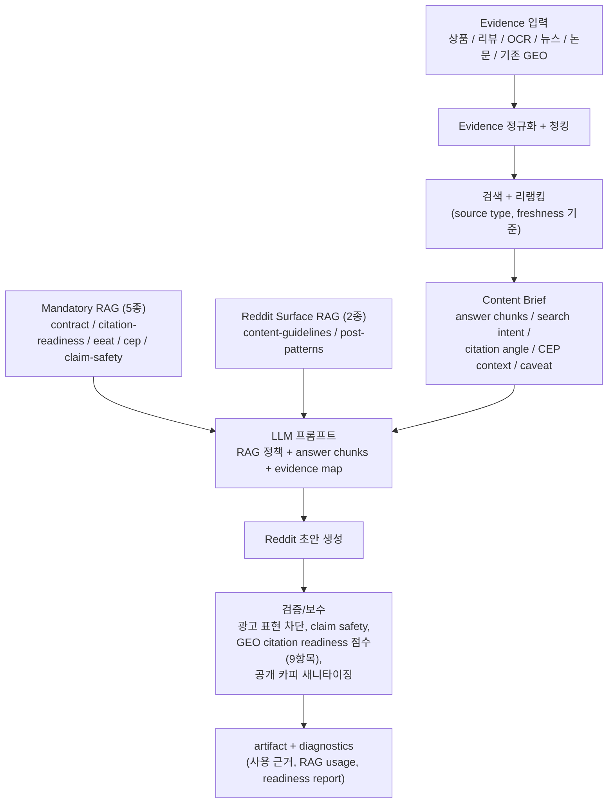

# GEO Citation Content Agent

`packages/geo-citation-content-agent`는 상품 정보와 근거 자료를 받아, ChatGPT, Gemini, Perplexity 같은 생성형 검색/답변 엔진에서 참고하기 좋은 외부 채널용 콘텐츠를 만드는 sub agent입니다.

현재 첫 번째 목표 채널은 **Reddit**입니다. 다만 패키지 이름과 내부 구조는 Reddit에 묶지 않았고, 나중에 YouTube나 Blog surface를 추가할 수 있게 설계했습니다.

## 쉽게 말하면

이 agent는 홍보글을 만드는 도구가 아닙니다.

상품 기본정보, 리뷰, 이미지/OCR 정보, 관련 뉴스, 연구논문, 기존 PDP GEO 결과를 받아서 다음 조건을 만족하는 Reddit 글을 만듭니다.

- 구체적인 질문에 답하는 구조
- 상품 claim과 근거 연결
- 리뷰/뉴스/논문/이미지 근거 구분
- 과장 표현과 단정형 효능 표현 방지
- 비교, 사용 맥락, 한계, caveat 포함
- 사람이 쓴 정보성 토론글처럼 자연스러운 문장
- 내부 diagnostics에 어떤 근거가 쓰였는지 기록

목표는 **AI가 가져가기 쉬운 answer chunk**와 **Reddit 사람이 봐도 거부감 없는 토론글** 사이의 균형입니다.

## 아키텍처

```txt
상품/근거 입력
  -> 상품 신호 정규화
  -> Mandatory RAG 로드
  -> Reddit Surface RAG 로드
  -> Evidence RAG 구성
  -> Content Brief 생성
  -> Reddit 글 생성
  -> claim/channel 검증
  -> 최종 artifact + diagnostics 반환
```

### Mandatory RAG

항상 들어가는 공통 원칙입니다.

- Citation-ready content contract
- GEO citation readiness
- E-E-A-T
- CEP
- Claim safety

이 문서들은 글이 광고처럼 흐르지 않도록 막고, 근거 기반의 정보성 콘텐츠가 되도록 제어합니다.

### Evidence RAG

요청마다 들어오는 실제 근거입니다.

- 상품 정보
- 리뷰
- 이미지/OCR 정보
- 뉴스 기사
- 연구 논문
- 기존 PDP GEO 결과

이 근거들은 chunk로 나뉘고, 상품/검색 의도에 맞게 검색 및 리랭킹된 뒤 글의 claim과 연결됩니다.

### RAG 활용 플로우

두 종류의 RAG(정책 문서, 근거 자료)가 생성 프롬프트와 검증 단계에 어떻게 흘러가는지는 다음과 같습니다.



- **정책 RAG는 방향을 제어**합니다: 광고가 아닌 근거 기반 토론글 형식, claim-evidence 분리, caveat 필수.
- **Evidence RAG는 내용을 공급**합니다: 각 claim은 evidence id로 근거에 연결되고, 공개 카피에서는 id가 제거되지만 diagnostics에는 전체 추적이 남습니다.
- 최종 결과는 GEO citation readiness 점수(구조 9항목 × 0.78 + 키워드 커버리지 × 0.22, 통과 기준 0.78)로 검증됩니다.

## Reddit 결과물

대표 결과는 Reddit에 올리기 좋은 글입니다.

```ts
{
  artifact: {
    surface: "reddit",
    title: "...",
    bodyMarkdown: "...",
    flairSuggestion: "Discussion",
    subredditFitNotes: ["..."],
    disclosureNote: "...",
    commentSeeds: ["..."]
  },
  strategy: {
    searchIntent: ["..."],
    citationAngles: ["..."],
    evidenceMap: ["..."],
    eeatSignals: ["..."],
    cepContexts: ["..."]
  },
  diagnostics: {
    mandatoryRagDocuments: ["..."],
    evidence: [
      {
        field: "readiness.geoCitation",
        source: "readiness",
        value: "GEO citation readiness passed with score 0.92."
      }
    ],
    recommendations: [],
    selectedRagChunks: ["..."],
    ragUsage: ["..."],
    runtimeUsage: {
      provider: "azure-openai",
      service: "Azure API model deployment",
      called: true
    },
    usedEvidence: ["..."],
    unsupportedClaims: [],
    channelWarnings: [],
    promotionalToneScore: 0,
    geoCitationReadiness: {
      passed: true,
      score: 0.92,
      keywordCoverage: {
        present: ["Hydra Barrier Cream", "moisturizer", "hydration"],
        missing: []
      }
    }
  }
}
```

`artifact`는 사람이 볼 결과물이고, `diagnostics`는 어떤 근거와 규칙이 쓰였는지 확인하는 내부 기록입니다.

`geoCitationReadiness`는 Reddit 글이 GEO에 맞게 인용 가능한 구조와 키워드 신호를 갖췄는지 확인합니다. 예를 들어 answer-ready 제목, 짧은 요약 chunk, claim/evidence 표현, 리뷰/논문/뉴스 같은 source 구분, caveat, 비교 맥락, 커뮤니티 질문, anti-promo, freshness signal을 체크합니다.

`diagnostics.evidence`, `diagnostics.recommendations`, `diagnostics.ragUsage`, `diagnostics.runtimeUsage`는 기존 다른 agent들처럼 생성 과정의 판단 근거를 남깁니다. 어떤 RAG 문서가 적용됐는지, 어떤 evidence chunk가 선택됐는지, GEO readiness에서 무엇이 통과/누락됐는지, Azure 모델 호출 구성이 무엇이었는지 확인할 수 있습니다.

## 사용 예시

```ts
import { generateGeoCitationContent } from "@agentic-geo/geo-citation-content-agent";

const run = await generateGeoCitationContent({
  product: {
    name: "Hydra Barrier Cream",
    description: "Daily cream for dry skin, hydration, and skin barrier support.",
    category: "moisturizer",
    benefits: ["hydration", "skin barrier support"],
    ingredients: ["Ceramide", "Hyaluronic Acid"],
    usage: ["Apply after serum."]
  },
  source: {
    type: "manual-json",
    observedAt: "2026-07-01"
  },
  evidence: {
    reviews: [
      {
        text: "Several reviewers mention that it absorbs quickly and works under makeup.",
        observedAt: "2026-07-01"
      }
    ],
    researchPapers: [
      {
        title: "Ceramide-containing moisturizers and barrier care",
        text: "Ceramide-containing moisturizers are often discussed as supportive for skin barrier care.",
        publishedAt: "2025-11-15"
      }
    ]
  },
  target: {
    surface: "reddit",
    locale: "en-US",
    communityOrChannelHint: "r/SkincareAddiction"
  },
  strategy: {
    contentAngle: "claim-check"
  }
});

console.log(run.result.artifact.title);
console.log(run.result.artifact.bodyMarkdown);
console.log(run.result.diagnostics.usedEvidence);
```

## 같은 상품도 매번 다르게 만들기

상품 정보는 같아도 글의 각도는 달라질 수 있습니다.

- claim-check
- comparison
- use-case-fit
- review-pattern
- skeptical-research
- buyer-question

기본 동작은 매번 다른 variant strategy를 만들 수 있게 되어 있습니다. 테스트나 재현 가능한 결과가 필요하면 seed를 넣으면 됩니다.

```ts
strategy: {
  variants: {
    seed: "stable-test"
  }
}
```

## Azure OpenAI 연동

기본값은 mock writer입니다. 실제 모델로 Reddit 제목과 본문을 생성하려면 기존 패키지들과 같은 방식으로 Azure OpenAI deployment 정보를 넘기면 됩니다.

```ts
const run = await generateGeoCitationContent(input, {
  provider: "azure-openai",
  apiKey: process.env.AZURE_OPENAI_API_KEY,
  endpoint: process.env.AZURE_OPENAI_ENDPOINT,
  deployment: process.env.AZURE_OPENAI_DEPLOYMENT,
  apiVersion: process.env.AZURE_OPENAI_API_VERSION,
  temperature: 0.7
});
```

`deployments.reasoning`을 쓰는 구성도 지원합니다.

```ts
const run = await generateGeoCitationContent(input, {
  provider: "azure-openai",
  apiKey: process.env.AZURE_OPENAI_API_KEY,
  endpoint: process.env.AZURE_OPENAI_ENDPOINT,
  deployments: {
    reasoning: process.env.AZURE_OPENAI_REASONING_DEPLOYMENT
  }
});
```

Azure 모델은 Reddit artifact를 JSON으로 생성하고, agent는 그 결과를 다시 claim/channel validator로 검사합니다.

## REST Adapter

Next.js Route Handler, Express, Hono 같은 Web API 환경에서는 REST handler로 감쌀 수 있습니다.

```ts
import { createGeoCitationContentRestHandler } from "@agentic-geo/geo-citation-content-agent/rest";

export const POST = createGeoCitationContentRestHandler();
```

요청은 `generateGeoCitationContent` 입력과 같은 모양입니다.

REST에서는 `llm`에 Azure 설정을 넣을 수 있습니다.

```json
{
  "product": {
    "name": "Hydra Barrier Cream"
  },
  "target": {
    "surface": "reddit"
  },
  "llm": {
    "provider": "azure-openai",
    "apiKey": "...",
    "endpoint": "https://example.openai.azure.com",
    "deployment": "gpt-4.1",
    "apiVersion": "2025-04-01-preview"
  }
}
```

## 현재 지원 범위

현재 런타임 구현 surface는 Reddit만 지원합니다.

```ts
type SupportedGeoCitationSurface = "reddit";
type GeoCitationSurface = "reddit" | "youtube" | "blog";
```

YouTube와 Blog는 추후 surface pack으로 확장할 수 있도록 타입과 registry 구조만 열어두었습니다.

YouTube를 추가할 경우 이 agent는 영상 파일이 아니라 제목, 설명란, 스크립트, 챕터, 썸네일 brief 같은 영상 제작용 content package를 만들게 됩니다. 실제 영상 렌더링은 별도 video production agent의 역할입니다.
