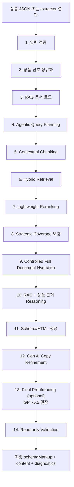
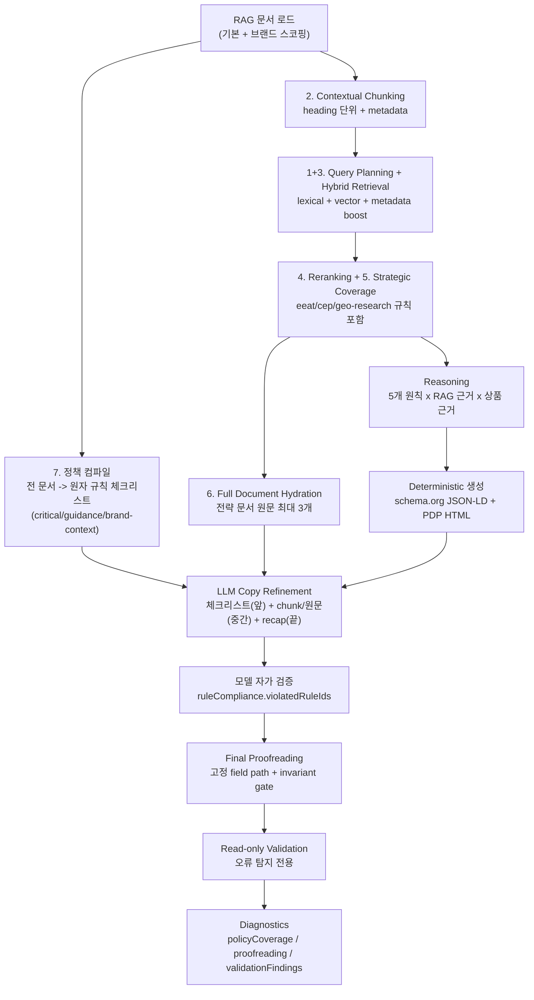

# PDP GEO Generator Agent

`packages/pdp-geo-generator-agent`는 상품 데이터를 GEO(Generative Engine Optimization)에 맞는 PDP 산출물로 재구성하는 sub agent입니다.

쉽게 말하면, 상품 기본정보, 효능/효과, 성분, 사용법, 고객 리뷰, 브랜드 맥락을 받아서 다음 결과를 만듭니다.

- schema.org JSON-LD
- 복사 가능한 `<script type="application/ld+json">`
- PDP에 넣을 수 있는 HTML content
- 어떤 근거와 RAG 문서가 쓰였는지 확인할 수 있는 diagnostics

이 패키지는 UI에 의존하지 않습니다. 내부 CMS, 백오피스, batch job, REST API, Next.js Route Handler에서 독립적으로 사용할 수 있고, 전체 Agentic GEO 흐름에서는 `pdp-extractor-agent` 이후의 생성/검증 단계를 담당합니다.

> 구조화 데이터는 상품과 페이지의 의미를 명확히 하고 검색 기능의 적격성을 높이는 수단이지, ChatGPT·Gemini·Perplexity 또는 Google 검색의 인용·노출을 보장하는 장치가 아닙니다. [Google 공식 가이드](https://developers.google.com/search/docs/fundamentals/ai-optimization-guide)는 AI Overviews/AI Mode를 위한 별도 특수 스키마가 없다고 안내하며, 구조화 데이터와 사용자에게 보이는 본문이 일치해야 합니다. [Google FAQ rich result는 2026-05-07부터 더 이상 표시되지 않으므로](https://developers.google.com/search/updates), 이 패키지의 `FAQPage`는 가시적인 상품 Q&A를 표현하는 schema.org 의미 계층으로만 사용합니다. ChatGPT Search 검색 대상이 되려면 [운영 페이지에서 `OAI-SearchBot` 접근도 허용](https://help.openai.com/en/articles/12627856-publishers-and-developers-faq)해야 합니다.

현재 생성 경로는 정규화된 상품 신호를 원자 단위 `Evidence Ledger`로 만든 뒤, 모델이 evidence ID를 참조하는 `Content/Schema Plan`에서 설명·FAQ·CEP·HowTo 적합성을 먼저 결정합니다. FAQ는 최소 개수를 채우지 않습니다. HowTo는 원문에 구체적인 사용 행동이 있을 때만 생성하며, 하나의 사용 지침은 Step 1 하나로, 원문에 명시된 다단계 절차는 원래 개수와 순서대로 유지합니다. 특정 브랜드/상품 문장을 고치는 예외 대신 evidence role, locale, graph integrity 계약으로 결과를 검증합니다.

## 빠른 호출 가이드

이 패키지는 독립 HTTP 서버가 아니라, 앱/서버에서 import해서 쓰는 agent 라이브러리입니다. 호출 방식은 두 가지입니다.

### 함수로 직접 호출

```ts
import { generatePdpGeo } from "@agentic-geo/pdp-geo-generator-agent";

const run = await generatePdpGeo({
  product: {
    name: "Hydra Barrier Cream",
    description: "Daily hydration cream for moisture barrier care.",
    benefits: ["hydration"],
    usage: ["Apply after serum."]
  },
  hints: {
    locale: "ko-KR",
    market: "KR"
  }
});

console.log(run.result.schemaMarkup.scriptTag);
console.log(run.result.content.html);
```

### REST API로 노출

Next.js Route Handler, Express, Hono, Worker 같은 Web API 환경에 REST handler를 붙이면 POST로 호출할 수 있습니다.

```ts
import { createPdpGeoGeneratorRestHandler } from "@agentic-geo/pdp-geo-generator-agent/rest";

export const POST = createPdpGeoGeneratorRestHandler({
  provider: "mock",
  rag: {
    mode: "local-versioned-rag"
  }
});
```

요청 payload:

```json
{
  "product": {
    "name": "Hydra Barrier Cream",
    "description": "Daily hydration cream for moisture barrier care."
  },
  "hints": {
    "locale": "ko-KR",
    "market": "KR"
  }
}
```

`apps/geo-generator`에서는 이 adapter가 이미 `/api/generator`에 연결되어 있습니다. URL/REST API 수집부터 GEO 생성까지 한 번에 실행하려면 `/api/generate` 오케스트레이션 route를 사용합니다.

## 핵심 개념

이 agent는 단순히 상품명을 키워드로 늘리는 도구가 아닙니다. 상품 데이터를 보고, RAG 문서의 기준을 참고해, AI 검색/생성형 답변에서 이해하기 쉬운 구조로 재작성합니다.

| 개념 | 비개발자용 설명 |
| --- | --- |
| 상품 데이터 | 상품명, 브랜드, 카테고리, 성분, 효능, 사용법, 리뷰, 이미지/OCR 문장 등 |
| RAG 문서 | agent가 참고하는 내부 가이드 문서입니다. E-E-A-T, CEP, GEO 연구, schema.org, locale 표현 규칙이 들어 있습니다. |
| Agentic Query Planning | 전체 문서를 한 번에 찾는 대신, FAQ 업데이트인지 HowToUse 업데이트인지처럼 목적별 질문을 나눠 검색합니다. |
| Hybrid Retrieval | 정확한 단어 검색과 의미 기반 검색을 함께 사용합니다. 성분명처럼 정확해야 하는 정보와, 고객 의도처럼 의미가 중요한 정보를 같이 찾습니다. |
| Contextual Chunking | 문서를 그냥 자르지 않고, 문서명, 섹션명, intent, 적용 필드를 함께 붙여 검색합니다. |
| Reranking | 1차 검색 결과를 다시 정렬해 이번 작업에 더 맞는 문서를 위로 올립니다. |
| Controlled Full Document Hydration | 선택된 핵심 전략 문서는 일부 요약만 쓰지 않고 원문 전체를 함께 전달합니다. 단, 원문 전체는 배경/충돌해결용이고, 실제 우선순위는 선택된 chunk가 가집니다. |
| Field Evidence Contract | 사용법, 성분, 효능, 리뷰, 메트릭 근거가 각자 맞는 schema/content 필드에 들어가도록 RAG와 validation이 함께 확인하는 계약입니다. |

## 전체 동작 흐름



각 단계의 의미는 다음과 같습니다.

| 단계 | 하는 일 |
| --- | --- |
| 입력 검증 | 상품 JSON, locale, market, fieldMapping, RAG 옵션을 검증합니다. |
| 상품 신호 정규화 | 다양한 상품 API/PDP JSON을 내부 `PdpProductSignal`로 정리합니다. 필요하면 상품 정규화 agent가 raw JSON과 RAG 문서를 함께 보고 field routing을 추론합니다. |
| RAG 문서 로드 | `src/rag`의 schema.org, E-E-A-T, CEP, GEO 연구, official docs, locale 문서를 읽습니다. |
| Agentic Query Planning | 전체 생성인지, FAQ만 갱신인지, HowToUse만 갱신인지에 따라 subquery를 만듭니다. |
| Contextual Chunking | RAG 문서를 섹션 단위로 나누고 문서명, heading path, intent, field target을 붙입니다. |
| Hybrid Retrieval | lexical score, local vector similarity, metadata boost를 함께 사용해 관련 문서를 찾습니다. |
| Lightweight Reranking | field target, intent, 상품 근거와의 겹침, 전략 문서 여부를 반영해 검색 결과를 다시 정렬합니다. |
| Strategic Coverage 보강 | `geo-research`, `cep`, `eeat` 전략 문서가 최종 후보에서 빠지면 해당 문서만 보충 검색합니다. |
| Controlled Full Document Hydration | 선택된 전략 문서의 원문 전체를 모델 payload에 넣어 누락을 줄입니다. |
| Reasoning | FAQ, HowTo, claim safety, customer context, review intent별로 어떤 근거를 쓸지 결정합니다. |
| 생성 | schema.org JSON-LD와 PDP HTML content를 만듭니다. |
| Copy Refinement | 선택적으로 Gen AI가 Product/WebPage description과 공개 설명 문장을 더 자연스럽고 answer-ready하게 다듬습니다. |
| Final Proofreading | 별도 마지막 LLM 호출이 고정된 Product/WebPage/FAQ/HowTo 문자열의 문법·어색함·중복만 검수합니다. 사실·수치·근거·항목 구조가 바뀌면 제안을 폐기합니다. |
| Read-only Validation | 최종 JSON-LD와 HTML 구조를 검사하고 findings만 기록하며 공개 문장을 다시 쓰지 않습니다. |

## RAG 문서 구성

기본 RAG 문서는 `src/rag`에 있습니다.

```txt
src/rag/
  rag-index.ts
  analysis-prompt_v1.md
  schema-org-product_v1.md
  eeat_v1.md
  cep_v1.md
  best-practice_v1.md
  geo-research_v1.md
  official-ai-search-platform-docs_v1.md
  locale-expression-guidelines_v1.md
  locale-terminology-map_v1.json
  brands/
    sulwhasoo/
      brand-identity_v1.md
      best-practice_v1.md
      locale-expression-guidelines_v1.md
      locale-terminology-map_v1.json
    aestura/
      brand-identity_v1.md
      best-practice_v1.md
      locale-expression-guidelines_v1.md
      locale-terminology-map_v1.json
  custom/
  manifest.ts
  profile.ts
```

각 문서의 역할은 다음과 같습니다.

| 문서 | 역할 |
| --- | --- |
| `analysis-prompt_v1.md` | 전체 생성 원칙과 RAG orchestration 기준 |
| `schema-org-product_v1.md` | Product, WebPage, FAQPage, HowTo, BreadcrumbList 구조화 기준 |
| `eeat_v1.md` | 신뢰, 근거, claim safety, 리뷰 표현, 과장 방지 기준 |
| `cep_v1.md` | 고객이 상품을 찾는 상황, 루틴, 고민, 리뷰 질문을 표현하는 기준 |
| `geo-research_v1.md` | GEO 연구, answer readiness, citation readiness, AI 검색 최적화 원칙 |
| `best-practice_v1.md` | 내부 GEO 생성 품질 기준과 PDP content 작성 기준 |
| `official-ai-search-platform-docs_v1.md` | OpenAI, Google Search Central, Gemini, Perplexity 등 공식 문서 기반 retrieval/structured data 기준 |
| `locale-expression-guidelines_v1.md` | locale별 표현 톤과 금지/권장 표현 |
| `locale-terminology-map_v1.json` | 시장별 용어 치환/회피 map |
| `brands/{brand}/brand-identity_v1.md` | 브랜드별 아이덴티티, 톤, 고객 진입 맥락, claim safety, GEO field projection 기준 |
| `brands/{brand}/best-practice_v1.md` | 기본 best-practice를 기반으로 한 브랜드별 GEO 생성 품질 기준 |
| `brands/{brand}/locale-expression-guidelines_v1.md` | 기본 locale 표현 가이드를 기반으로 한 브랜드별 언어/톤 기준 |
| `brands/{brand}/locale-terminology-map_v1.json` | 기본 terminology map을 기반으로 한 브랜드별 선호/회피 용어 map |

브랜드 문서는 상품 브랜드와 매칭될 때만 생성 RAG 후보에 포함됩니다. 예를 들어 에스트라 상품 요청에는 `brands/aestura/brand-identity_v1.md`, `brands/aestura/best-practice_v1.md`, `brands/aestura/locale-expression-guidelines_v1.md`, `brands/aestura/locale-terminology-map_v1.json`만 포함되고, 설화수 문서는 제외됩니다. 브랜드별 best-practice, locale expression guide, terminology map이 있으면 기본 문서는 제외하고 해당 브랜드 문서를 우선 사용합니다. 브랜드를 식별할 수 없거나 해당 브랜드별 문서가 없으면 기본 `best-practice_v1.md`, `locale-expression-guidelines_v1.md`, `locale-terminology-map_v1.json`을 fallback으로 사용하고, `brands/` 하위 문서는 제외합니다.

`rag-index.ts`는 단순한 파일 목록이 아니라 RAG 문서의 source of truth입니다. 각 문서와 주요 섹션에 다음 metadata를 붙입니다.

- 문서 종류: schema, eeat, cep, geo-research, best-practice, official-docs, locale 등
- source role: policy, research, official-reference, locale-map
- checked date
- intent: faq, howTo, claims, customer, review, schema, evidence, retrieval 등
- field target: `Product.description`, `WebPage.description`, `FAQPage.mainEntity`, `HowTo.step` 등
- priority
- rule extraction: `rules`(요구사항으로 강제) 또는 `narrative`(브랜드 서사/포지셔닝 맥락 — 정책 체크리스트에서 low-priority guidance로 강등되어 규칙으로 위장하지 못함)

## RAG를 추론에 활용하는 방식

이 agent는 RAG 문서를 “많이 넣는 것”보다 “필요한 문서를 정확하게 찾고, 중요한 전략 문서는 원문 전체로 보강하며, 전체 요구사항은 컴파일된 체크리스트로 빠짐없이 전달하는 것”을 목표로 합니다.

한 번의 생성에서 RAG 문서가 흘러가는 전체 경로는 다음과 같습니다.



핵심은 세 개의 상호 보완 채널입니다: **검색된 chunk**(현재 상품과 가장 관련 높은 지침), **hydrated 원문**(전략 문서의 충돌 해석/맥락), **컴파일된 정책 체크리스트**(검색에서 빠진 문서까지 포함한 전체 요구사항). 의미 생성이 끝난 뒤 Final Proofreading은 문장 표면만 다루고, 마지막 validator는 산출물을 수정하지 않고 문제만 보고합니다.

### 1. Agentic Query Planning

상품정보가 일부만 업데이트될 수 있기 때문에, agent는 먼저 작업 목적을 나눕니다.

예를 들어 FAQ와 HowToUse만 바뀐 경우:

```ts
const run = await generatePdpGeo({
  product: updatedProduct,
  hints: {
    locale: "ko-KR",
    market: "KR",
    updateTargets: ["faq", "howToUse"]
  },
  rag: {
    queryPlanning: {
      enabled: true,
      includeBaseQuery: true
    }
  }
});
```

이렇게 하면 query plan은 보통 다음처럼 나뉩니다.

```txt
general     - 전체 schema/evidence/locale 기준 확인
faq         - FAQPage.mainEntity, 리뷰 질문, claim safety 기준 검색
howToUse    - HowTo.step, 사용 순서, 루틴/타이밍 기준 검색
```

결과는 `diagnostics.ragQueryPlan`에서 확인할 수 있습니다.

### 2. Contextual Chunking

RAG 문서는 heading 단위로 나뉩니다. 다만 본문만 embedding하지 않고, 다음 정보까지 함께 검색 텍스트에 넣습니다.

```txt
Document: eeat_v1.md
Section: 8.2 Partial Update Query Planning
Heading path: E-E-A-T Guidance v1 > 8. GEO Application > 8.2 Partial Update Query Planning
RAG kind: eeat
Source role: policy
Generation intents: retrieval, faq, howTo, schema
Schema and content fields: retrieval, FAQPage.mainEntity, HowTo.step, Product.description
Content: ...
```

이렇게 하면 “FAQ 업데이트”를 검색할 때 단순히 FAQ라는 단어가 있는 문서뿐 아니라, 실제로 FAQ 필드에 연결된 E-E-A-T/CEP/GEO 섹션을 더 잘 찾을 수 있습니다.

### 3. Hybrid Retrieval

로컬 기본 검색은 다음 점수를 섞습니다.

```txt
최종 1차 점수 = lexical similarity + local vector similarity + metadata boost
```

- lexical similarity: 정확한 단어가 맞는지 봅니다. 예: `FAQPage`, `HowTo.step`, `Niacinamide`
- local vector similarity: 의미적으로 가까운지 봅니다. 현재는 deterministic hash vector를 사용합니다.
- metadata boost: 문서 priority, source role, schema/official docs/strategy 문서 여부를 반영합니다.

로컬 vector 차원은 hash collision을 줄이기 위해 384차원으로 구성되어 있습니다.

### 4. Lightweight Reranking

1차 검색 후 다시 정렬합니다.

reranking은 다음을 추가로 봅니다.

- subquery가 원하는 field target과 chunk의 field target이 맞는가
- subquery intent와 chunk intent가 맞는가
- 상품명, 브랜드, 카테고리, 성분, 효능, 리뷰 키워드와 chunk가 실제로 겹치는가
- GEO/CEP/E-E-A-T 전략 문서가 필요한 작업인가

이 단계 덕분에 단순히 점수가 높은 문서보다, 이번 생성 작업에 더 직접적으로 필요한 문서가 위로 올라옵니다.

### 5. Strategic Coverage

GEO 생성에서 `geo-research`, `cep`, `eeat`는 전략 문서입니다.

일반 검색 결과에서 이 문서들이 밀릴 수 있기 때문에, agent는 최종 후보에 전략 문서가 빠졌는지 확인합니다. 빠졌다면 해당 전략 문서만 별도로 작게 검색해서 보강합니다.

이 보강은 모든 문서를 무조건 넣는 방식이 아닙니다. 전략 문서가 후보군에 없을 때만 작동합니다.

### 6. Controlled Full Document Hydration

Evidence-bound Content Plan에는 선택된 작업 관련 chunk excerpt, 원자 상품 근거, 컴파일된 정책 규칙의 압축 표현을 전달합니다. hydration된 전략 문서 전체는 넣지 않아 중요 지시의 희석과 입력 크기를 줄이면서, `diagnostics.policyCoverage`에 기록된 critical/guidance 규칙이 실제 planning 문맥에서도 누락되지 않게 합니다.

다만 원문 전체는 다음 원칙으로 사용됩니다.

1. 선택된 chunk가 현재 작업의 1순위 기준입니다.
2. full document는 누락 방지, 충돌 해석, 정책 완결성 확인용입니다.
3. 상품 데이터에 근거가 없는 예시나 claim은 적용하지 않습니다.
4. 충돌이 생기면 상품 원본 근거를 최우선으로 보고, 그다음 E-E-A-T trust/safety, schema validity, GEO answer-readiness, CEP customer phrasing 순서로 적용합니다.
5. public schema/content에는 `RAG`, `GEO`, `CEP`, `E-E-A-T`, `citation-ready` 같은 내부 전략 용어를 노출하지 않습니다.

이 구조는 전체 문서를 넣을 때 생길 수 있는 본질 흐림을 줄이고, 동시에 문서 일부만 넣을 때 생기는 누락을 줄입니다.

### 7. Compiled Policy Checklist와 진단

retrieval top-K와 hydration만으로는 "선택되지 않은 문서의 요구사항"이 모델에 도달하지 못할 수 있습니다. 이를 막기 위해 rag-load 단계에서 로드된 모든 RAG 정책 문서를 결정적으로 파싱해 원자 규칙(atomic rule) 체크리스트로 컴파일합니다 (`src/rag/policy-compiler.ts`).

- 각 markdown 문서의 목록 항목을 규칙 단위로 추출하고, heading 계층 스택으로 `###` 하위 섹션이 `##` 부모 섹션의 rag-index metadata(intent/fieldTarget/priority)를 상속합니다.
- 규칙 텍스트를 정규화해 default 문서와 브랜드 오버레이 문서 간 중복을 제거합니다.
- `must/never/do not/금지/반드시` 계열 표현은 `critical`, 나머지는 `guidance`로 분류합니다.
- rag-index에서 `ruleExtraction: "narrative"`로 표시된 섹션(브랜드 아이덴티티의 Identity Pillars, 서사/출처 목록 등)의 항목은 규칙이 아닌 브랜드 맥락으로 취급되어 guidance로 강등되고 priority가 0.6 이하로 제한됩니다. 프롬프트에서는 `[brand-context]` 라벨로 구분되어 "어휘/무드로만 쓰고 product claim으로 변환 금지" 지시를 받습니다.
- 규칙 커버리지는 `diagnostics.policyCoverage`로 계속 측정합니다. 컴파일된 critical/guidance 체크리스트는 evidence-bound content planner에 압축 주입되며, 명시적 legacy copy refinement를 함께 사용할 때는 해당 검증 프롬프트에도 전달됩니다.
- 기본 Content Plan은 선택된 task guidance와 evidence ID 계약을 사용하고, 전체 체크리스트를 장문 프롬프트로 반복 주입하지 않습니다.
- planner의 evidence/locale/modality gate와 최종 schema/content validator에서 거절된 항목은 `contentPlan.warnings`, `diagnostics.evidence`, `validationRepairs`로 기록됩니다.

`rag.policyChecklist` 설정으로 조정할 수 있습니다: `{ enabled, maxRules, maxRuleChars }`.

## Evidence-bound Content/Schema Planning

provider API 또는 `customContentPlanner`가 설정되면 public copy를 렌더링하기 전에 모델이 strict structured output으로 다음을 결정합니다.

이 단계에서 모델은 다음 정보를 받습니다.

- `Product.description`과 `WebPage.description`의 서로 다른 entity role 및 evidence ID
- FAQ 질문 의도, CEP, 직접 답변, evidence ID, 포함/제외 결정
- HowTo의 구체적 사용 행동 여부, 원문 단계 경계·순서 및 각 step의 usage evidence ID
- 원문에서 확인되는 CEP 상황·필요·제약
- 근거 부족 시 `omitReason`

OpenAI Responses, Gemini, Azure OpenAI, AI Studio는 provider-native JSON Schema를 사용합니다. 모델 기반 첫 계획은 동일 schema의 2차 evidence-entailment 감사에서 claim modality, caveat, 번역 의미, evidence ID 연결을 다시 확인합니다. 유효하지 않은 evidence ID, target locale 혼합, 단위가 바뀐 수치, 근거에 없는 효능/성분, 구체적 행동이 없거나 원문 단계 경계·순서를 바꾼 HowTo는 거절되며 한 번의 교정 결과도 통과하지 못하면 해당 선택 필드를 생략합니다. 모델이 없을 때는 보수적 renderer가 실행되며 선택 스키마를 quota로 채우지 않습니다.

## Diagnostics로 확인할 수 있는 것

실행 후 `diagnostics`에서 RAG 흐름을 확인할 수 있습니다.

| 필드 | 설명 |
| --- | --- |
| `diagnostics.ragQueryPlan` | 어떤 subquery가 생성됐는지 |
| `diagnostics.selectedRagChunks` | 최종 컨텍스트로 선택된 chunk |
| `diagnostics.evidenceLedger` | public claim이 참조할 수 있는 원자 상품 근거와 안정적인 evidence ID |
| `diagnostics.contentPlan` | description/FAQ/HowTo/CEP 포함 여부, evidence ID, confidence, omit reason |
| `diagnostics.hydratedRagDocuments` | 원문 전체가 hydration된 전략 문서 |
| `diagnostics.policyCoverage` | 컴파일된 정책 규칙 수, 프롬프트 주입 수, critical 커버리지 비율, 문서별/제외 규칙 내역 |
| `diagnostics.reasoning` | 어떤 RAG 원칙과 상품 근거가 연결됐는지 |
| `diagnostics.ragUsage` | FAQ, HowTo, claim safety 등 원칙별 참조 문서 |
| `diagnostics.evidence` | 생성/보정/LLM refinement의 적용 또는 거절 근거 |
| `diagnostics.finalProofreading` | 마지막 교정 호출 여부, 적용 필드, 거절된 변경과 사유 |
| `diagnostics.finalPublicCopyProvenance` | 최종 공개 문장별 text/hash와 유지된 evidence ID 결합 |
| `diagnostics.validationWarnings` | JSON-LD/HTML 검증 경고 |
| `diagnostics.validationFindings` | 읽기 전용 검증이 발견한 문제와 제안 조치 |
| `diagnostics.validationRepairs` | 런타임에서는 빈 배열. legacy 직접 repair API 호환용 필드 |

## Field Evidence Contract

생성 품질은 문장을 많이 만드는 것보다, 상품 근거가 올바른 필드에 들어가는지에 크게 좌우됩니다. 이 agent는 RAG 문서와 validation 단계에서 같은 field contract를 사용합니다.

| 필드 | 허용되는 근거 | 제거/보정되는 오염 예시 |
| --- | --- | --- |
| `HowTo.step` | 원문에 있는 구체적 사용 행동. 하나의 지침은 Step 1 하나, 명시된 다단계 절차는 원래 개수와 순서 유지 | 행동 없는 빈도·양·주의 메모, 임상 수치, 효능, 성분 설명, 리뷰 요약, 원문에 없는 단계 분할·병합 |
| `content.sections.howToUse`, Usage property | 근거가 있는 일반 사용 지침을 포함하며 HowTo가 부적합해도 표시 가능 | 임상 수치, 효능 문장, 성분 설명, 리뷰 요약 |
| `content.sections.ingredients` | 성분명, formula technology, INCI/full ingredient, 성분 역할 설명 | 리뷰 표현, routine 문장, 검색 의도 문장, 효능 요약 |
| `content.sections.benefits`, `positiveNotes` | 효능/효과, 고객이 이해할 수 있는 outcome, 짧은 evidence topic | 긴 임상 원문, 내부 diagnostic label, 원시 메트릭 문장 |
| `Product.additionalProperty` | key ingredient, key benefit, reported detail, usage timing, texture, review context 같은 atomic fact | multiline quick facts, public copy용 문장 덩어리 |

읽기 전용 검증 단계에서 이 계약을 어긴 문장은 `validationFindings`에 기록되며 최종 문장을 자동으로 다시 쓰지 않습니다. 따라서 생성·교정 단계의 근거 계약을 보존한 채 새 상품의 필드 오염을 추적할 수 있습니다.

## Basic Usage

```ts
import { generatePdpGeo } from "@agentic-geo/pdp-geo-generator-agent";

const run = await generatePdpGeo({
  product: {
    item: {
      title: "Hydra Barrier Cream",
      body: "Daily hydration cream for moisture barrier care."
    },
    reviews: {
      keywords: ["hydration", "smooth texture"]
    }
  },
  hints: {
    locale: "ko-KR",
    market: "KR",
    category: "크림"
  },
  fieldMapping: {
    name: "item.title",
    description: "item.body"
  },
  rag: {
    mode: "local-versioned-rag"
  }
});

console.log(run.result.schemaMarkup.scriptTag);
console.log(run.result.content.html);
console.log(run.diagnostics.selectedRagChunks);
console.log(run.diagnostics.hydratedRagDocuments);
```

## Optional Product Signal Normalization

기본 실행은 `fieldMapping`과 deterministic 부트스트랩으로 `PdpProductSignal`을 만듭니다.

내부 API key가 자주 바뀌거나 section label이 브랜드/몰마다 달라져 스크립트에 key 후보를 계속 하드코딩해야 하는 경우, `productNormalization.enabled` 또는 `customProductNormalizer`를 사용합니다.

상품 정규화 agent는 raw JSON, bootstrap product, fieldMapping, hints, analysis prompt, RAG 문서를 함께 보고 field routing을 추론합니다. 모델/커스텀 agent가 제안한 값은 원본 상품 JSON 또는 bootstrap product에 근거가 있는 경우에만 반영됩니다.

```ts
const run = await generatePdpGeo(input, {
  provider: "openai",
  apiKey: process.env.OPENAI_API_KEY,
  model: process.env.OPENAI_MODEL,
  productNormalization: {
    enabled: true,
    maxRagDocuments: 8,
    maxSourceCharacters: 35000
  }
});
```

## Evidence-bound Content/Schema Planning

non-mock provider와 API key가 있으면 Content Plan은 기본 활성화됩니다. 명시적으로 끄거나 모델/입력 크기를 별도 설정할 수 있습니다.

```ts
const run = await generatePdpGeo(input, {
  provider: "openai",
  apiKey: process.env.OPENAI_API_KEY,
  model: process.env.OPENAI_MODEL,
  contentPlanning: {
    enabled: true,
    maxEvidenceItems: 120,
    maxRagChunks: 5
  }
});

console.log(run.diagnostics.evidenceLedger);
console.log(run.diagnostics.contentPlan);
```

## Optional Review Keyword Normalization

리뷰 키워드 오타 후보를 모델로 검수하려면 명시적으로 켭니다. 모델은 원본 리뷰 키워드 후보만 보정할 수 있고, 번역/확장/새 효능 생성은 안전 필터에서 제외됩니다.

```ts
const run = await generatePdpGeo(input, {
  provider: "openai",
  apiKey: process.env.OPENAI_API_KEY,
  model: process.env.OPENAI_MODEL,
  keywordNormalization: {
    enabled: true,
    confidenceThreshold: 0.82
  }
});
```

## Optional Legacy Gen AI Copy Refinement

새 Content Plan이 정상 적용되면 별도의 copy refinement는 기본적으로 생략됩니다. 기존 integration 호환이나 추가 후처리가 꼭 필요할 때만 `copyRefinement.enabled: true`로 명시합니다.

이때 모델은 선택된 chunk와 hydration된 전체 전략 문서를 함께 봅니다. 하지만 상품 근거가 없는 효능, 성분, 수치, 리뷰, 인증, 가격은 만들 수 없습니다.

```ts
const run = await generatePdpGeo(input, {
  provider: "azure-openai",
  apiKey: process.env.AZURE_OPENAI_API_KEY,
  endpoint: process.env.AZURE_OPENAI_ENDPOINT,
  deployments: {
    reasoning: process.env.AZURE_OPENAI_REASONING_DEPLOYMENT
  },
  apiVersion: process.env.AZURE_OPENAI_API_VERSION,
  copyRefinement: {
    enabled: true
  }
});
```

## Final Proofreading (GPT-5.5 권장)

`finalProofreading`은 의미 생성과 legacy copy refinement가 모두 끝난 뒤 선택적으로 실행되는 독립적인 마지막 LLM 호출입니다. Product/WebPage description, FAQ 질문·답변, HowTo step text 중에서 최종 렌더링 문장·source hash·유효한 evidence ID가 정확히 결합된 필드만 전달합니다. copy refinement가 문장을 바꾸고 새 근거 결합을 만들지 않았다면 해당 필드는 호출 전에 제외합니다. 숫자·단위·상품명·브랜드명·성분명·claim 강도·리뷰 귀속·문장 유형·FAQ/HowTo 구조가 바뀌면 제안을 적용하지 않고 원본을 유지합니다.

자동 적용 범위는 구두점·공백, 인접한 동일 단어/문장의 중복 제거와 폐쇄형 의미 보존 문법 교정입니다. 영문은 `a/an`, 동일 시제의 주어-동사 일치, 제한된 현재형 claim 동사 일치, FAQ 보조동사 도치만 허용하고, 국문은 동일 문법 역할의 조사 이형태와 제한된 문장 종결 활용만 허용합니다. 전치사·시제·태·claim modality·내용어 순서·한국어 조사 역할이 달라지는 변경은 거절합니다. HowTo는 계속 구두점·공백만 수정할 수 있습니다. 허용 목록으로 설명할 수 없는 어색함은 원문을 유지하고 warning으로 기록합니다. 승인된 문장은 최종 text/hash와 기존 evidence ID를 다시 결합해 `finalPublicCopyProvenance`에 남깁니다.

라이브러리에서는 추가 비용과 지연을 소급하지 않도록 opt-in입니다. 메인 앱은 non-mock provider와 API key가 있으면 이를 활성화하며, Azure에서는 `AZURE_OPENAI_PROOFREADING_DEPLOYMENT`를 우선 사용하고 없으면 reasoning deployment를 사용합니다.

```ts
const run = await generatePdpGeo(input, {
  provider: "azure-openai",
  apiKey: process.env.AZURE_OPENAI_API_KEY,
  endpoint: process.env.AZURE_OPENAI_ENDPOINT,
  apiVersion: process.env.AZURE_OPENAI_API_VERSION,
  finalProofreading: {
    enabled: true,
    deployment: process.env.AZURE_OPENAI_PROOFREADING_DEPLOYMENT,
    maxOutputTokens: 4000
  }
});

console.log(run.diagnostics.finalProofreading);
console.log(run.diagnostics.validationFindings);
```

## RAG 설정 예시

```ts
const run = await generatePdpGeo({
  product,
  hints: {
    locale: "ko-KR",
    market: "KR",
    updateTargets: ["faq", "howToUse"]
  },
  rag: {
    mode: "local-versioned-rag",
    maxChunks: 12,
    scoreThreshold: 0,
    queryPlanning: {
      enabled: true,
      includeBaseQuery: true,
      updateTargets: ["faq", "howToUse"]
    },
    fullDocumentHydration: {
      enabled: true,
      strategicOnly: true,
      maxDocuments: 3
    }
  }
});
```

`fullDocumentHydration`은 기본적으로 전략 문서에 대해 켜져 있습니다. 운영에서 context 비용을 줄이고 싶으면 끌 수 있습니다.

```ts
rag: {
  fullDocumentHydration: {
    enabled: false
  }
}
```

## RAG Modes

| mode | 설명 |
| --- | --- |
| `local-versioned-rag` | 기본값입니다. `src/rag`의 버전 관리 문서를 로컬에서 contextual chunking하고 hybrid scoring과 lightweight reranking으로 검색합니다. |
| `managed-vector-store-rag` | OpenAI Vector Store Search adapter 또는 `customRetriever` 기반 managed 검색을 사용합니다. |

## REST Handler

Web API `Request`/`Response` 기반 REST handler를 만들 수 있습니다.

```ts
import { createPdpGeoGeneratorRestHandler } from "@agentic-geo/pdp-geo-generator-agent/rest";

export const POST = createPdpGeoGeneratorRestHandler({
  provider: "openai",
  apiKey: process.env.OPENAI_API_KEY,
  model: process.env.OPENAI_MODEL,
  rag: {
    mode: "local-versioned-rag"
  }
});
```

`products` 배열을 넘기면 여러 상품을 한 번에 처리합니다. 일부 상품만 실패하면 REST handler는 HTTP `207`과 함께 `results`, `logs`, `failures`를 반환합니다.

## Output Contract

주요 산출물은 `PdpGeoGenerationRun`입니다.

| 필드 | 설명 |
| --- | --- |
| `result.schemaMarkup.jsonLd` | schema.org JSON-LD graph |
| `result.schemaMarkup.scriptTag` | 복사 가능한 `<script type="application/ld+json">` |
| `result.content.html` | GEO 최적화 PDP HTML |
| `result.content.sections` | `productName`, `description`, `quickFacts`, `benefits`, `ingredients`, `howToUse`, `faq` |
| `diagnostics.normalizedProduct` | 정규화된 내부 product signal |
| `diagnostics.evidenceLedger` | role/sourcePath/confidence를 가진 원자 근거 |
| `diagnostics.contentPlan` | evidence-bound field/schema applicability plan |
| `diagnostics.selectedRagChunks` | 최종 생성에 사용한 RAG chunk |
| `diagnostics.hydratedRagDocuments` | controlled full document hydration으로 전달된 전략 문서 |
| `diagnostics.reasoning` | RAG와 상품 근거를 연결한 reasoning 결과 |
| `diagnostics.ragUsage` | 원칙별 RAG 참조 내역 |
| `diagnostics.recommendations` | GEO/schema/content 개선 제안 |
| `diagnostics.evidence` | 입력, RAG, terminology, validator, repair, LLM refinement 근거 |
| `diagnostics.terminology` | locale별 적용/회피 용어 결정 |
| `diagnostics.finalProofreading` | 마지막 fluency-only 호출의 적용·거절 내역 |
| `diagnostics.validationWarnings` | 읽기 전용 검증에서 남긴 경고 |
| `diagnostics.validationFindings` | 최종 산출물을 변경하지 않는 검증 결과 |
| `process` | UI/REST 로그에 표시할 stage별 진행 상태 |

## 주요 파일

| 파일 | 설명 |
| --- | --- |
| `src/agent.ts` | 생성 pipeline의 중심 로직, query planning, strategic coverage, hydration |
| `src/normalize.ts` | 임의 product JSON을 `PdpProductSignal`로 부트스트랩 정규화 |
| `src/product-normalizer.ts` | RAG-aware Gen AI 상품 신호 정규화와 source-backed 적용 필터 |
| `src/content-planner.ts` | Evidence Ledger, strict structured-output Content/Schema Plan, evidence/locale gate, corrective retry |
| `src/generate.ts` | schema.org JSON-LD와 HTML content 생성 |
| `src/copy-refiner.ts` | Gen AI 기반 public copy refinement와 provider adapter |
| `src/final-proofreader.ts` | GPT-5.5 final fluency-only 교정, strict output, 불변성 gate, fail-safe |
| `src/validate.ts` | 런타임 read-only 검증과 legacy repair API |
| `src/graph-integrity.ts` | 빈 선택 노드 제거, dangling reference 정리, schema/visible content parity |
| `src/rag/rag-index.ts` | RAG 문서/섹션의 typed metadata source of truth |
| `src/rag/retrieval.ts` | contextual chunking, local hybrid retrieval, lightweight reranking, managed retrieval adapter |
| `src/rest.ts` | REST handler 생성기 |
| `src/types.ts` | 공개 타입과 Zod 입력 스키마 |

## 명령어

```bash
pnpm --filter @agentic-geo/pdp-geo-generator-agent test
pnpm --filter @agentic-geo/pdp-geo-generator-agent typecheck
pnpm --filter @agentic-geo/pdp-geo-generator-agent build
pnpm --filter @agentic-geo/pdp-geo-generator-agent lint
```
