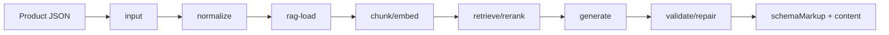

# PDP GEO Generator Agent

`packages/pdp-geo-generator-agent`는 Agentic GEO의 GEO 생성 sub agent입니다. 임의 상품 JSON 또는 `pdp-extractor-agent`가 만든 GEO RAW JSON을 받아 product signal로 정규화하고, RAG guidance와 locale terminology를 적용해 schema.org JSON-LD, 복사용 script tag, GEO 최적화 PDP HTML content, validation diagnostics를 생성합니다.

이 패키지는 앱 UI에 의존하지 않습니다. 서비스 API, Next.js Route Handler, batch job, 내부 CMS/백오피스에서 독립적으로 호출할 수 있고, Agentic GEO 전체 오케스트레이션에서는 추출 이후의 생성/검증 단계를 담당합니다.

## When To Use

| 상황 | 사용 방식 |
| --- | --- |
| PDP URL 추출 결과로 GEO artifact 생성 | `pdp-extractor-agent`의 `result.geoProduct`를 `product`로 전달 |
| 내부 상품 API JSON을 바로 변환 | `product`와 `fieldMapping`을 함께 전달 |
| locale/market별 표현 통제 | `hints.locale`, `hints.market`, RAG terminology map 사용 |
| 리뷰 키워드 오타 보정 | `keywordNormalization.enabled` 또는 `customKeywordNormalizer` 사용 |
| 자체 검색 인프라 연결 | `managed-vector-store-rag`와 `customRetriever` 계약 사용 |
| 생성 결과 QA 자동화 | `diagnostics.validationWarnings`, `evidence`, `selectedRagChunks` 확인 |

## Pipeline



| Stage | 역할 |
| --- | --- |
| `input` | 임의 상품 JSON과 생성 옵션 검증 |
| `normalize` | REST/API/PDP JSON을 내부 `PdpProductSignal`로 변환 |
| `rag-load` | schema.org, E-E-A-T, CEP, GEO, official docs, locale RAG 프로필 로드 |
| `chunk` | 버전 문서와 상품 컨텍스트를 검색 가능한 chunk로 준비 |
| `embed` | 로컬 hash embedding 또는 managed vector store 전략 적용 |
| `retrieve` | 상품, locale, schema target 기반 RAG 검색 |
| `rerank` | schema, locale, terminology, GEO 관련성 기준 재정렬 |
| `generate` | JSON-LD schema markup과 PDP HTML content 생성 |
| `validate` | JSON-LD와 HTML 구조 검증 |
| `repair` | 누락 필드와 안전하지 않은 HTML 방어 보정 |
| `artifact` | 복사 가능한 최종 산출물 직렬화 |

## Basic Usage

```ts
import { generatePdpGeo } from "@agentic-geo/pdp-geo-generator-agent";

const run = await generatePdpGeo({
  product: {
    item: {
      title: "Hydra Barrier Cream",
      body: "Daily hydration cream for moisture barrier care."
    },
    reviews: {
      keywords: ["hydration", "smooth texture"]
    }
  },
  hints: {
    locale: "ko-KR",
    market: "KR",
    category: "크림"
  },
  fieldMapping: {
    name: "item.title",
    description: "item.body"
  },
  rag: {
    mode: "local-versioned-rag"
  }
});

console.log(run.result.schemaMarkup.scriptTag);
console.log(run.result.content.html);
console.log(run.diagnostics.validationWarnings);
```

### Optional Review Keyword Normalization

기본 실행은 deterministic 규칙만 사용합니다. 리뷰 키워드 오타 후보를 모델로 검수하려면 생성 옵션에서 명시적으로 켭니다. 모델은 원본 리뷰 키워드 후보만 보정할 수 있고, 번역/확장/새 효능 생성은 안전 필터에서 제외됩니다.

```ts
const run = await generatePdpGeo(
  {
    product: {
      geoProduct: {
        name: "Hydra Texture Cream",
        reviews: {
          keywords: ["피부걸", "흡수감"]
        }
      }
    },
    hints: {
      locale: "ko-KR",
      market: "KR"
    }
  },
  {
    provider: "openai",
    apiKey: process.env.OPENAI_API_KEY,
    model: process.env.OPENAI_MODEL,
    keywordNormalization: {
      enabled: true,
      confidenceThreshold: 0.82
    }
  }
);
```

테스트나 사내 사전/검수 agent가 있으면 네트워크 provider 대신 `customKeywordNormalizer`를 주입할 수 있습니다.

### Optional Gen AI Copy Refinement

상품 근거 조립과 schema/content 구조 생성은 deterministic 로직으로 먼저 수행합니다. 다만 `Product.description`, `WebPage.description`, `content.sections.description`처럼 AI answer에 노출될 공개 문장은 규칙 기반 정규화만으로 “어떤 상품 fact를 골라 조합해야 하는지”까지 판단하기 어렵기 때문에, provider API가 설정되어 있으면 생성 직후 Gen AI copy refinement를 선택적으로 실행할 수 있습니다.

이 단계는 `geo-research`(기존 `geo-paper`), `cep`, `eeat` RAG를 전략 근거로 삼아, 가져온 상품 정보 데이터 안에서 AI가 인용하거나 답변에 활용하기 좋은 키워드와 문장을 선별한 뒤 자연스럽게 조합합니다. 새 효능/성분/수치/리뷰를 만들지 않고, 이미 추출된 상품 신호와 선택된 RAG chunk 안에서만 재구성합니다. 모델 결과가 너무 짧거나 길거나 `RAG`, `GEO`, `CEP`, `E-E-A-T`, 이미지 캡션성 표현 같은 내부/시각 아티팩트를 포함하면 폐기하고 deterministic 문장을 유지합니다.

```ts
const run = await generatePdpGeo(input, {
  provider: "azure-openai",
  apiKey: process.env.AZURE_OPENAI_API_KEY,
  endpoint: process.env.AZURE_OPENAI_ENDPOINT,
  deployments: {
    reasoning: process.env.AZURE_OPENAI_REASONING_DEPLOYMENT
  },
  apiVersion: process.env.AZURE_OPENAI_API_VERSION,
  copyRefinement: {
    enabled: true
  }
});
```

테스트나 내부 LLM gateway를 쓰는 경우 `customCopyRefiner`를 주입할 수 있습니다. copy refinement 호출 여부와 token usage는 `diagnostics.runtimeUsage.steps`의 `final` 단계에 기록되고, 적용/거절 근거와 전략 RAG 출처는 `diagnostics.evidence`에 남습니다.

## REST Handler

Web API `Request`/`Response` 기반 REST 핸들러를 만들 수 있습니다.

```ts
import { createPdpGeoGeneratorRestHandler } from "@agentic-geo/pdp-geo-generator-agent/rest";

export const POST = createPdpGeoGeneratorRestHandler({
  provider: "openai",
  apiKey: process.env.OPENAI_API_KEY,
  model: process.env.OPENAI_MODEL,
  rag: {
    mode: "local-versioned-rag"
  }
});
```

요청 예시:

```json
{
  "product": {
    "item": {
      "title": "Hydra Barrier Cream",
      "body": "Daily cream for dry skin and skin barrier support."
    }
  },
  "hints": {
    "locale": "ko-KR",
    "market": "KR"
  },
  "fieldMapping": {
    "name": "item.title",
    "description": "item.body"
  },
  "rag": {
    "mode": "local-versioned-rag"
  },
  "keywordNormalization": {
    "enabled": true,
    "provider": "openai",
    "model": "your-keyword-normalization-model"
  },
  "copyRefinement": {
    "enabled": true
  }
}
```

`products` 배열을 넘기면 여러 상품을 한 번에 처리합니다. 일부 상품만 실패하면 REST handler는 HTTP `207`과 함께 `results`, `logs`, `failures`를 반환합니다.

## Output Contract

주요 산출물은 `PdpGeoGenerationRun`입니다.

| 필드 | 설명 |
| --- | --- |
| `result.schemaMarkup.jsonLd` | schema.org JSON-LD graph |
| `result.schemaMarkup.scriptTag` | 복사 가능한 `<script type="application/ld+json">` |
| `result.content.html` | GEO 최적화 accordion HTML |
| `result.content.sections` | `productName`, `description`, `quickFacts`, `benefits`, `ingredients`, `howToUse`, `faq` |
| `diagnostics.normalizedProduct` | 정규화된 내부 product signal |
| `diagnostics.recommendations` | GEO/schema/content 개선 제안 |
| `diagnostics.evidence` | 입력, RAG, terminology, validator, repair 근거 |
| `diagnostics.selectedRagChunks` | 최종 생성에 사용한 RAG chunk |
| `diagnostics.terminology` | locale별 적용/회피 용어 결정 |
| `diagnostics.validationWarnings` | 검증과 보정 과정에서 남긴 경고 |
| `process` | UI/REST 로그에 표시할 stage별 진행 상태 |

## RAG Modes

- `local-versioned-rag`: 기본값입니다. `src/rag`의 버전 관리 문서를 로컬에서 chunking하고 deterministic hash vector와 local hybrid scoring으로 검색합니다.
- `managed-vector-store-rag`: OpenAI Vector Store Search adapter 또는 `customRetriever` 기반 managed 검색을 사용합니다.

기본 RAG 프로필:

```txt
src/rag/
  analysis-prompt_v1.md
  schema-org-product_v1.md
  eeat_v1.md
  cep_v1.md
  best-practice_v1.md
  geo-research_v1.md
  official-ai-search-platform-docs_v1.md
  locale-expression-guidelines_v1.md
  locale-terminology-map_v1.json
  manifest.ts
  profile.ts
```

문서명은 기능 중심으로 유지합니다. `eeat_v1.md`는 trust/evidence quality, `cep_v1.md`는 customer entry point intent, `geo-research_v1.md`는 generative search/GEO research guidance를 담당합니다. 이 세 문서는 모든 reasoning principle의 공통 RAG 근거로 들어가고, schema/best-practice/official-docs/locale 문서는 원칙별로 추가됩니다.

RAG routing은 문서 전체가 아니라 chunk intent 기준으로 동작합니다. 로컬 기본 문서와 사용자가 추가한 custom RAG 문서는 heading/text를 분석해 `faq`, `howTo`, `claims`, `customer`, `review`, `schema`, `locale`, `evidence`, `retrieval`, `general` intent와 schema/content field target을 부여합니다. Reasoning은 FAQ/HowTo/claims/customer/review principle별로 해당 intent와 field target을 우선 선택해 `best-practice_v1.md#FAQ Best Practice`처럼 섹션 단위 출처를 유지합니다.

`rag.resolveUrls: true`를 사용하면 RAG 문서에 포함된 URL을 최대 `maxResolvedUrlDocuments`개까지 가져와 같은 chunk/intent 분석 흐름에 넣습니다. 기본 URL resolver는 HTML/text/markdown/JSON 계열만 처리하고 localhost/private IP를 차단합니다. 운영 환경에서 사내 프록시, 캐시, 논문 파서, allowlist가 필요하면 `customUrlResolver`로 교체할 수 있습니다.

Resolved URL content는 전체 원문이 아니라 GEO-relevant excerpt로 축약됩니다. URL 유형은 `official-paper`, `schema-reference`, `provider-doc`, `official-doc`, `other`로 분류되며, official paper는 citation readiness/visibility/source attribution, schema reference는 type/property compatibility, provider docs는 retrieval/embedding/grounding/source-evidence mechanics, official docs는 structured data eligibility와 product evidence guidance 중심으로 발췌합니다.

`manifest.ts`는 현재 사용하는 파일 조합을 고정합니다.

```ts
export const pdpGeoGeneratorRagManifest = {
  profile: "pdp-geo-generator-default",
  analysisPrompt: "analysis-prompt_v1.md",
  documents: {
    schemaOrgProduct: "schema-org-product_v1.md",
    eeat: "eeat_v1.md",
    cep: "cep_v1.md",
    bestPractice: "best-practice_v1.md",
    geoResearch: "geo-research_v1.md",
    officialAiSearchPlatformDocs: "official-ai-search-platform-docs_v1.md",
    localeExpressionGuidelines: "locale-expression-guidelines_v1.md",
    localeTerminologyMap: "locale-terminology-map_v1.json"
  }
} as const;
```

## Validation And Repair

생성 후 바로 반환하지 않고 다음 항목을 검증합니다.

- JSON-LD `@context`가 `https://schema.org`인지 확인
- `@graph`가 없거나 `Product` node가 없으면 최소 Product node 추가
- `Product.name`, `Product.description` 누락 시 fallback 값 보정
- `FAQPage` Question/Answer와 `HowTo` step 구조 정리
- accordion HTML에서 `<script>`, inline event, style attribute, 허용되지 않은 tag 제거

보정 내역은 `diagnostics.validationWarnings`와 `diagnostics.evidence`에 남습니다.

## 주요 타입

| 타입 | 설명 |
| --- | --- |
| `PdpGeoGenerationInput` | 사용자/서비스가 넘기는 생성 요청 |
| `PdpGeoGeneratorOptions` | provider, RAG, progress callback, custom retriever 옵션 |
| `PdpGeoGenerationRun` | 결과, diagnostics, process를 포함한 전체 실행 결과 |
| `PdpGeoGenerationResult` | 최종 schema/content artifact |
| `PdpGeoDiagnostics` | normalized product, recommendations, evidence, RAG, terminology, validation warning |
| `PdpGeoFieldMapping` | 임의 REST JSON path를 내부 signal로 연결하는 mapping |
| `PdpGeoRagSettings` | local/managed RAG 검색 설정 |

## 주요 파일

| 파일 | 설명 |
| --- | --- |
| `src/agent.ts` | 생성 pipeline의 중심 로직 |
| `src/normalize.ts` | 임의 product JSON을 `PdpProductSignal`로 정규화 |
| `src/generate.ts` | schema.org JSON-LD와 HTML content 생성 |
| `src/copy-refiner.ts` | Gen AI 기반 public copy refinement와 provider adapter |
| `src/validate.ts` | JSON-LD/HTML 검증과 repair |
| `src/rag/retrieval.ts` | local/managed RAG 검색과 reranking |
| `src/rest.ts` | REST 핸들러 생성기 |
| `src/types.ts` | 공개 타입과 Zod 입력 스키마 |

## 명령어

```bash
pnpm --filter @agentic-geo/pdp-geo-generator-agent test
pnpm --filter @agentic-geo/pdp-geo-generator-agent typecheck
pnpm --filter @agentic-geo/pdp-geo-generator-agent build
pnpm --filter @agentic-geo/pdp-geo-generator-agent lint
```
