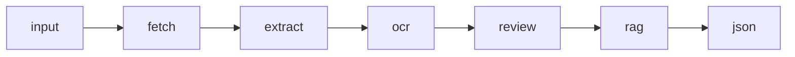

# Product Extractor Agent

`packages/product-extractor-agent`는 상품 상세 페이지 또는 REST API 응답을 GEO RAW JSON으로 정리하는 독립 에이전트 패키지입니다. 앱 없이도 함수로 직접 호출할 수 있고, Next.js Route Handler 같은 Web API 환경에서 REST 어댑터로 사용할 수 있습니다.

## 담당 범위

- URL 또는 REST API 입력 검증
- HTML, meta tag, JSON-LD, embedded client state 수집
- 상품명, 가격, 설명, 이미지, 옵션 추출
- FAQ 후보 정리
- 리뷰 평점, 리뷰 본문, 대표 키워드 추출
- 이미지 alt/text와 상세 영역 텍스트 기반 OCR 후보 분류
- RAG chunk 생성
- 진행 단계와 evidence/warning 진단 로그 생성
- GEO RAW JSON 결과 수정 요청 처리

## 처리 파이프라인



각 단계는 `ProductExtractionStep`으로 기록되며 UI의 진행 패널과 REST 응답 로그에서 같은 단계명을 사용합니다.

| 단계 | 설명 |
| --- | --- |
| `input` | URL/REST API 입력 검증과 정규화 |
| `fetch` | HTML 또는 API JSON 수집 |
| `extract` | 상품 기본 정보 추출 |
| `ocr` | 이미지/상세 영역의 OCR 후보 키워드 분류 |
| `review` | 리뷰 신호와 고객 표현 정리 |
| `rag` | 상품/리뷰/FAQ/OCR 근거를 RAG chunk로 변환 |
| `json` | 최종 GEO RAW JSON 생성 |

## 공개 API

패키지는 다음 entry point를 export합니다.

```ts
import {
  extractProduct,
  extractProductFromHtml,
  refineGeoProductResult,
  createProductExtractorRestHandler
} from "@agentic-geo/product-extractor-agent";
```

### `extractProduct`

URL 또는 REST API를 직접 수집해 결과를 만듭니다.

```ts
import { extractProduct } from "@agentic-geo/product-extractor-agent";

const run = await extractProduct(
  {
    sourceType: "url",
    source: "https://example.com/products/serum",
    aiProvider: "openai"
  },
  {
    provider: "openai",
    apiKey: process.env.OPENAI_API_KEY,
    model: process.env.OPENAI_MODEL,
    onProgress(step) {
      console.log(step.id, step.status);
    }
  }
);

console.log(run.result.geoProduct);
console.log(run.diagnostics.evidence);
```

### `extractProductFromHtml`

이미 수집한 HTML 문자열이 있을 때 사용합니다.

```ts
import { extractProductFromHtml } from "@agentic-geo/product-extractor-agent";

const run = await extractProductFromHtml(html, "https://example.com/products/serum", {
  provider: "mock"
});
```

### `createProductExtractorRestHandler`

Web API `Request`/`Response` 기반 REST 핸들러를 만듭니다.

```ts
import { createProductExtractorRestHandler } from "@agentic-geo/product-extractor-agent/rest";

export const POST = createProductExtractorRestHandler({
  provider: "openai",
  apiKey: process.env.OPENAI_API_KEY,
  model: process.env.OPENAI_MODEL
});
```

요청 예시:

```json
{
  "sources": ["https://example.com/products/serum"],
  "sourceType": "url",
  "headers": {
    "Accept": "text/html"
  },
  "llm": {
    "provider": "openai",
    "apiKey": "sk-...",
    "model": "gpt-..."
  },
  "rag": {
    "analysisPrompt": "추가 분석 기준",
    "documents": [
      {
        "name": "brand-guide_v1.md",
        "content": "브랜드 분석 기준..."
      }
    ]
  }
}
```

응답 형태:

```json
{
  "results": [],
  "logs": [],
  "failures": []
}
```

일부 소스만 실패하면 HTTP `207`로 성공 결과와 실패 목록을 함께 반환합니다.

### `refineGeoProductResult`

이미 생성된 GEO RAW JSON에서 사용자가 요청한 상품 정보 필드만 부분 수정합니다.

```ts
import { refineGeoProductResult } from "@agentic-geo/product-extractor-agent";

const refinement = refineGeoProductResult({
  result,
  instruction: "상품명에서 용량 표기를 제거해줘"
});

console.log(refinement.result);
console.log(refinement.summary);
```

## LLM provider

지원 provider:

- `mock`
- `openai`
- `gemini`
- `azure-openai`

`mock`은 외부 API 호출 없이 구조와 테스트 흐름을 확인할 때 사용합니다. 실제 키워드 분류와 분석 품질 검증은 OpenAI, Gemini, Azure OpenAI provider를 사용합니다.

옵션 예시:

```ts
{
  provider: "azure-openai",
  apiKey: process.env.AZURE_OPENAI_API_KEY,
  endpoint: process.env.AZURE_OPENAI_ENDPOINT,
  deployment: process.env.AZURE_OPENAI_DEPLOYMENT,
  apiVersion: process.env.AZURE_OPENAI_API_VERSION
}
```

## RAG 프로필

기본 RAG 프로필은 `src/rag`에 있습니다.

```txt
src/rag/
  analysis-prompt_v1.md
  product-normalization_v1.md
  review-keyword-extraction_v1.md
  ocr-keyword-classification_v1.md
  faq-extraction_v1.md
  manifest.ts
  profile.ts
```

`manifest.ts`는 현재 사용하는 파일 조합을 고정합니다.

```ts
export const productExtractorRagManifest = {
  profile: "product-extractor-default",
  analysisPrompt: "analysis-prompt_v1.md",
  documents: {
    productNormalization: "product-normalization_v1.md",
    reviewKeywordExtraction: "review-keyword-extraction_v1.md",
    ocrKeywordClassification: "ocr-keyword-classification_v1.md",
    faqExtraction: "faq-extraction_v1.md"
  }
} as const;
```

앱의 설정 화면에서 추가한 커스텀 문서는 `src/rag/custom` 아래에 저장됩니다.

## 주요 타입

| 타입 | 설명 |
| --- | --- |
| `ProductExtractionInput` | 추출 요청 입력 |
| `ProductExtractionRun` | 결과와 진단 로그를 모두 포함한 실행 결과 |
| `ProductExtractionResult` | 최종 JSON 아티팩트 |
| `ProductExtractionDiagnostics` | 단계별 로그, evidence, warning |
| `GeoProductRawData` | downstream GEO 작업에 넘기는 상품 중심 데이터 |
| `ProductExtractorOptions` | provider, RAG, progress callback 옵션 |

## 주요 파일

| 파일 | 설명 |
| --- | --- |
| `src/agent.ts` | 추출 파이프라인의 중심 로직 |
| `src/rest.ts` | REST 핸들러 생성기 |
| `src/refine.ts` | GEO RAW JSON 수정 로직 |
| `src/types.ts` | 공개 타입과 Zod 입력 스키마 |
| `src/llm/providers.ts` | provider 선택 |
| `src/llm/providers/*` | provider별 키워드 분류 구현 |
| `src/rag/profile.ts` | RAG 파일 읽기/쓰기/초기화 |
| `tests/*` | 추출, REST, provider, RAG 프로필 테스트 |

## 명령어

```bash
pnpm --filter @agentic-geo/product-extractor-agent test
pnpm --filter @agentic-geo/product-extractor-agent typecheck
pnpm --filter @agentic-geo/product-extractor-agent build
pnpm --filter @agentic-geo/product-extractor-agent lint
```

## 설계 메모

- 이 패키지는 앱 UI에 의존하지 않습니다.
- provider와 RAG 설정은 패키지 내부 옵션으로 주입합니다.
- public result와 diagnostics를 분리해 최종 JSON은 깔끔하게 유지하고, 검증/디버깅 정보는 별도 로그로 제공합니다.
- 앞으로 다른 GEO 서브 에이전트가 추가되더라도 각 에이전트가 자기 RAG 문서와 provider 설정을 독립적으로 갖는 구조를 유지합니다.
